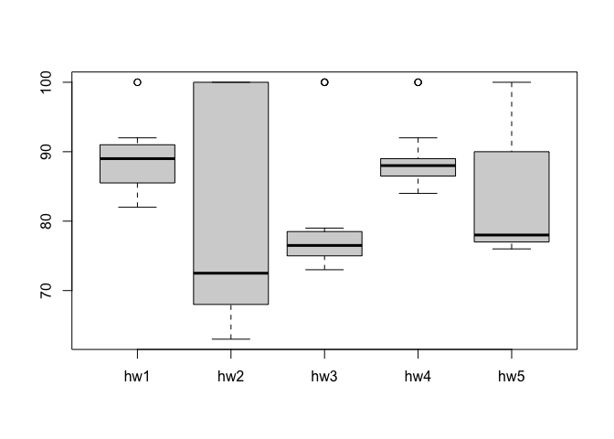

Class06
================
Gabrielle Meza (A13747395)
10/15/2021

## Quick Rmarkdown intro

The two hashtags mar the level heading type. Two is heading two

### Three hashtags have third level heading type (smaller)

We can write text just like any file. we can style text to be **bold**
or *italic* you can also make lists with bullets this way

Do:

-   This
-   and that
-   and another things

This is more text and this is a new line in the console.

To get a new line you need two spaces in Markdown. or a new return
character

------------------------------------------------------------------------

We can include some code: You can use the green button in top right, or
“option”+“commmand”+“I”

``` r
plot(1:10)
```

<!-- -->

## Time to write a function.

Do this on a smaller set of known vectors, and see if it works, then
apply to a larger dataset. \> **Q1**. Write a function grade() to
determine an overall grade from a vector of student homework assignment
scores dropping the lowest single score. If a student misses a homework
(i.e. has an NA value) this can be used as a score to be potentially
dropped. Your final function should be adquately explained with code
comments and be able to work on an example class gradebook such as this
one in CSV format: “<https://tinyurl.com/gradeinput>” \[3pts\]

``` r
student1 <- c(100, 100, 100, 100, 100, 100, 100, 90) 
student2 <- c(100, NA, 90, 90, 90, 90, 97, 80) 
student3 <- c(90, NA, NA, NA, NA, NA, NA, NA)
```

First I want to find the lowest score. I can use **min()** to find it
and the **which.min()** to find what position in the vector it is in

``` r
min(student1)
```

    ## [1] 90

``` r
which.min(student1)
```

    ## [1] 8

Now trying to get mean with excluding the lowest grade. You can use
minus to get everything in the vector besides what you are excluding.
And then you can do **mean()** function to get the average.

``` r
mean(student1[-which.min(student1)])
```

    ## [1] 100

This does not work for student2 because it has the NA value. the
which.min would be 8, which is 80. even though the lowest is the NA (0)

``` r
mean(student2[-which.min(student2)])
```

    ## [1] NA

``` r
mean(student2, na.rm = TRUE)
```

    ## [1] 91

Using na.rm mean to remove the NA works because NA is a set term in R
(wouldn’t work if it was different nomenclature) it could work in this
scenario, because there is only 1 NA so it would be dropped, but then
doesn’t work if there is more than 1 NA. So need to advise a better
function strategy. By using **is.na** which will identify which section
is NA. Then you can use the **which(is.na(student2))** to see what
position has the NA, then using the code form student 1 you then get the
average. But this only works if there is 1 NA.

``` r
is.na(student2)
```

    ## [1] FALSE  TRUE FALSE FALSE FALSE FALSE FALSE FALSE

``` r
which(is.na(student2))
```

    ## [1] 2

``` r
mean(student2[-which(is.na(student2))])
```

    ## [1] 91

To make this work for all types of scores , with multiple NAs, we can
make NA zero and then be able to calculate. Can set new thing to exactly
student2 just to work with it and then apply to everything. note use
\[\] to take and get something within the array!! This also saves it in
the environment as the new replaced

x \<– \[1:5\] x \[3\] = 100 (this would make the 3rd position in thei
vector the assigned value of 100)

``` r
student.prime <-student2
student.prime[ is.na(student.prime)] = 0
student.prime
```

    ## [1] 100   0  90  90  90  90  97  80

Getting there, now take everything we have done and put it together
pretty much

``` r
student.prime <-student2
student.prime[ is.na(student.prime)] = 0
mean(student.prime[-which.min(student.prime)])
```

    ## [1] 91

Now do for student 3, all you have to do is change the first student in
the first line

``` r
student.prime <-student3
student.prime[ is.na(student.prime)] = 0
mean(student.prime[-which.min(student.prime)])
```

    ## [1] 12.85714

Now time to simplify this and make as clear as possible. Lets make
object names more clear

``` r
x <- student3
x[is.na(x)] = 0
mean(x[-which.min(x)])
```

    ## [1] 12.85714

``` r
x <- student1
x[is.na(x)] = 0
mean(x[-which.min(x)])
```

    ## [1] 100

Now lets make another student! ahh you entered the data wrong! you made
90 not a “number” so you can use **as.numeric** to coearse all the
values into a numerical based number

``` r
student4 <- c(100, NA, 90, "90", 90, 90, 97, 80)
x <- student4 
x <- as.numeric(x)
x[is.na(x)] = 0
mean(x[ -which.min(x)])
```

    ## [1] 91

Now we are actually making a function for this: All functions have at
least there 3 things: A name, input args, and a body. You use { } and
then the brain saves this as a a function!

``` r
grade <- function(x) 
  { x <- as.numeric(x)
  x[is.na(x)] = 0
  mean(x[ -which.min(x)]) }
```

Now you you can run the function code that you assigned grade!!

``` r
grade(student1)
```

    ## [1] 100

## Now we are going ot grade a whole class and dataset

First, open you grade book:

``` r
gradebook <- "https://tinyurl.com/gradeinput"
scores <- read.csv (gradebook, row.names=1)
scores
```

    ##            hw1 hw2 hw3 hw4 hw5
    ## student-1  100  73 100  88  79
    ## student-2   85  64  78  89  78
    ## student-3   83  69  77 100  77
    ## student-4   88  NA  73 100  76
    ## student-5   88 100  75  86  79
    ## student-6   89  78 100  89  77
    ## student-7   89 100  74  87 100
    ## student-8   89 100  76  86 100
    ## student-9   86 100  77  88  77
    ## student-10  89  72  79  NA  76
    ## student-11  82  66  78  84 100
    ## student-12 100  70  75  92 100
    ## student-13  89 100  76 100  80
    ## student-14  85 100  77  89  76
    ## student-15  85  65  76  89  NA
    ## student-16  92 100  74  89  77
    ## student-17  88  63 100  86  78
    ## student-18  91  NA 100  87 100
    ## student-19  91  68  75  86  79
    ## student-20  91  68  76  88  76

We are going to use super helpful **apply()** function to to grade all
the students with our **grade()** function. This way, we don’t have to
enter student 1..2..3..4 and so on to get the data we want. MARGIN =1
(you can also write just 1, but make sure you do this different based on
to get either row or column!) You would write 2 to apply this whole
thing to all of the columns, 1 is used for every row.

``` r
apply(scores, MARGIN = 1, grade)
```

    ##  student-1  student-2  student-3  student-4  student-5  student-6  student-7 
    ##      91.75      82.50      84.25      84.25      88.25      89.00      94.00 
    ##  student-8  student-9 student-10 student-11 student-12 student-13 student-14 
    ##      93.75      87.75      79.00      86.00      91.75      92.25      87.75 
    ## student-15 student-16 student-17 student-18 student-19 student-20 
    ##      78.75      89.50      88.00      94.50      82.75      82.75

``` r
ans <- apply(scores, 1, grade)
```

Q2. Using your grade() function and the supplied gradebook, Who is the
top scoring student overall in the gradebook? \[3pts\]

``` r
which.max(apply(scores, 1, grade))
```

    ## student-18 
    ##         18

Q3. From your analysis of the gradebook, which homework was toughest on
students (i.e. obtained the lowest scores overall? \[2pts\] Don’t want
to use grade function because that would drop the lowest value, which is
not what this question is asking.

``` r
which.min(apply(scores, 2, mean, na.rm=TRUE))
```

    ## hw3 
    ##   3

``` r
HWgrade <- function(x) 
  { x <- as.numeric(x)
  x[is.na(x)] = 0
  mean(x) }

which.min(apply(scores, 2, HWgrade))
```

    ## hw2 
    ##   2

You can make a new function without this mean minus lowest score, but
you can also mask the NA values to zero. Set scores to mask so you can
change the mask and not mess up the imported original dataset. using
**mask\[is.na(mask)\]=0** you are able to change all the NA in the
scores (but mask (this was just a random choice in wording really)).

``` r
mask <- scores 
mask[is.na(mask)]=0 
mask
```

    ##            hw1 hw2 hw3 hw4 hw5
    ## student-1  100  73 100  88  79
    ## student-2   85  64  78  89  78
    ## student-3   83  69  77 100  77
    ## student-4   88   0  73 100  76
    ## student-5   88 100  75  86  79
    ## student-6   89  78 100  89  77
    ## student-7   89 100  74  87 100
    ## student-8   89 100  76  86 100
    ## student-9   86 100  77  88  77
    ## student-10  89  72  79   0  76
    ## student-11  82  66  78  84 100
    ## student-12 100  70  75  92 100
    ## student-13  89 100  76 100  80
    ## student-14  85 100  77  89  76
    ## student-15  85  65  76  89   0
    ## student-16  92 100  74  89  77
    ## student-17  88  63 100  86  78
    ## student-18  91   0 100  87 100
    ## student-19  91  68  75  86  79
    ## student-20  91  68  76  88  76

After that, you can use apply on our “masked” scored

``` r
apply(mask,2,mean)
```

    ##   hw1   hw2   hw3   hw4   hw5 
    ## 89.00 72.80 80.80 85.15 79.25

``` r
which.min(apply(mask, 2, mean))
```

    ## hw2 
    ##   2

Q4. Optional Extension: From your analysis of the gradebook, which
homework was most predictive of overall score (i.e. highest correlation
with average grade score)? \[1pt\]

Function to do basic correlation is based on a regression value, that is
**cor()** function in R platform. You can call the **cor()** for every
homework and get a value for each but that sucks. Instead, we would use
**apply()** and do them all in one go. You put ans after *cor()* becuase
that is how the ordering of this works

``` r
cor(mask$hw5, ans)
```

    ## [1] 0.6325982

``` r
apply(mask,2, cor, ans)
```

    ##       hw1       hw2       hw3       hw4       hw5 
    ## 0.4250204 0.1767780 0.3042561 0.3810884 0.6325982

You see that HW5 is most correlated to having the highest score

``` r
boxplot(scores)
```

<!-- -->
