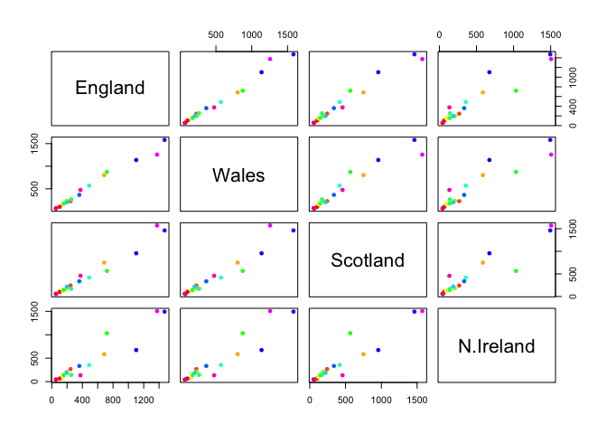
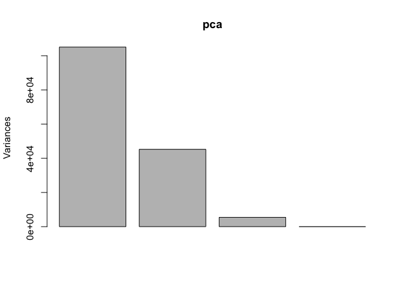

Machine Learning 1
================
Gabrielle Meza (A13747395)
10/22/2021

#Important take aways:

**kmeans(x,centers=?)**, **hclust()**

hclust doesnt impose on you data immediately, like kmeans() would.

hclust(dist(x)) take the distance matrix of x

##reminder: to insert r code without using button i console, can do
control+option+i

#Clustering methods Kmeans clustering in R is done with the ‘kmeans()’
function here we will makeup some data to test and learn with it

cbinds combines a vector into a dataset. y=rev takes the forward vector,
and maes the next column the reverse of it. so here we should get an
inverse dataset

``` r
tmp <- c(rnorm(30,3), rnorm(30,-3))
data <-cbind(x=tmp, y=rev(tmp))
data
```

    ##               x         y
    ##  [1,]  1.885595 -3.209384
    ##  [2,]  3.128932 -2.784439
    ##  [3,]  2.921216 -2.604063
    ##  [4,]  3.979690 -1.682364
    ##  [5,]  2.579515 -2.930651
    ##  [6,]  3.329498 -4.125204
    ##  [7,]  1.585604 -3.654108
    ##  [8,]  2.398671 -1.464876
    ##  [9,]  2.013658 -2.873425
    ## [10,]  4.941396 -2.863945
    ## [11,]  2.446623 -1.502456
    ## [12,]  2.608237 -3.968225
    ## [13,]  3.372889 -3.008891
    ## [14,]  2.700796 -2.087685
    ## [15,]  3.999860 -2.715385
    ## [16,]  1.291412 -1.181916
    ## [17,]  4.366957 -2.625641
    ## [18,]  4.741674 -1.909634
    ## [19,]  3.690989 -3.423656
    ## [20,]  2.106630 -3.250746
    ## [21,]  5.018574 -4.289436
    ## [22,]  3.416318 -4.618609
    ## [23,]  3.872870 -5.893273
    ## [24,]  3.613424 -4.736283
    ## [25,]  3.323159 -5.202860
    ## [26,]  3.549573 -2.655038
    ## [27,]  2.755385 -2.921782
    ## [28,]  2.849379 -2.380729
    ## [29,]  3.549440 -2.884979
    ## [30,]  1.195653 -2.553782
    ## [31,] -2.553782  1.195653
    ## [32,] -2.884979  3.549440
    ## [33,] -2.380729  2.849379
    ## [34,] -2.921782  2.755385
    ## [35,] -2.655038  3.549573
    ## [36,] -5.202860  3.323159
    ## [37,] -4.736283  3.613424
    ## [38,] -5.893273  3.872870
    ## [39,] -4.618609  3.416318
    ## [40,] -4.289436  5.018574
    ## [41,] -3.250746  2.106630
    ## [42,] -3.423656  3.690989
    ## [43,] -1.909634  4.741674
    ## [44,] -2.625641  4.366957
    ## [45,] -1.181916  1.291412
    ## [46,] -2.715385  3.999860
    ## [47,] -2.087685  2.700796
    ## [48,] -3.008891  3.372889
    ## [49,] -3.968225  2.608237
    ## [50,] -1.502456  2.446623
    ## [51,] -2.863945  4.941396
    ## [52,] -2.873425  2.013658
    ## [53,] -1.464876  2.398671
    ## [54,] -3.654108  1.585604
    ## [55,] -4.125204  3.329498
    ## [56,] -2.930651  2.579515
    ## [57,] -1.682364  3.979690
    ## [58,] -2.604063  2.921216
    ## [59,] -2.784439  3.128932
    ## [60,] -3.209384  1.885595

``` r
plot(data)
```

<!-- -->

We are now going to run kmeans on this run ‘kmeans()’ set k to 2 nstart
20. the thing with kmeans is you have to tell it how many clusters you
want. once you print it out, it will send out information. Cluster
means, is the center of the two groups. Km puts multiple things into a
list, can combine vectors and such into a list think of it as a
container, that is why $ is able to pull out a component.

the Clustering vector is

``` r
km <-kmeans(data, centers = 2, nstart=20)
km
```

    ## K-means clustering with 2 clusters of sizes 30, 30
    ## 
    ## Cluster means:
    ##           x         y
    ## 1  3.107787 -3.066782
    ## 2 -3.066782  3.107787
    ## 
    ## Clustering vector:
    ##  [1] 1 1 1 1 1 1 1 1 1 1 1 1 1 1 1 1 1 1 1 1 1 1 1 1 1 1 1 1 1 1 2 2 2 2 2 2 2 2
    ## [39] 2 2 2 2 2 2 2 2 2 2 2 2 2 2 2 2 2 2 2 2 2 2
    ## 
    ## Within cluster sum of squares by cluster:
    ## [1] 65.63434 65.63434
    ##  (between_SS / total_SS =  89.7 %)
    ## 
    ## Available components:
    ## 
    ## [1] "cluster"      "centers"      "totss"        "withinss"     "tot.withinss"
    ## [6] "betweenss"    "size"         "iter"         "ifault"

> 17. How many points are in each cluster?

When you use the $, it is looking for a colum or row tittle with that
name.

``` r
km$size
```

    ## [1] 30 30

> Q. what ‘component’ of your result oject details cluster assignment/
> membership?

``` r
km$cluster
```

    ##  [1] 1 1 1 1 1 1 1 1 1 1 1 1 1 1 1 1 1 1 1 1 1 1 1 1 1 1 1 1 1 1 2 2 2 2 2 2 2 2
    ## [39] 2 2 2 2 2 2 2 2 2 2 2 2 2 2 2 2 2 2 2 2 2 2

> Q. what ‘component’ of your result oject details cluster center?

``` r
km$centers
```

    ##           x         y
    ## 1  3.107787 -3.066782
    ## 2 -3.066782  3.107787

> Q. Plot x colored by the kmeans cluster assignment and add cluster
> centers as blue?

Different col number is different colors. but to color your different
groups based on the clustering, you can do **col=km$cluster**.

If you want to plot by cluster use **points(km$centers)** and other
componets too, pch turns into a square, cex, makes the square bigger

``` r
plot(data, col=km$cluster)
```

<!-- -->

For this next graph, you need the plot component to be there and then
can do points

``` r
plot(data, col=km$cluster)
points(km$centers, col="blue", pch=15, cex=2)
```

<!-- -->

#Hierarchial Clustering

we will use `hclust()`function on the same data as before and see how
this method works. **dist(data)** is just a way to get the distance
between points in you graph

``` r
hc <- hclust( dist(data))
hc
```

    ## 
    ## Call:
    ## hclust(d = dist(data))
    ## 
    ## Cluster method   : complete 
    ## Distance         : euclidean 
    ## Number of objects: 60

But hclust has a ploting method

``` r
plot(hc)
```

<!-- -->

Clustering, finds points that are close to each other, draws the
distance between them, then moves onto the next point, and then keeps
going. you can see in this plot that it the two main division is the
first 1-30, and then 30-60 that are separated. it means that these are
two groups separated.using this tree analysis.

to find our membership vector we need to “cut” the tree and for this we
use the **cutree()** funtion and tell it the height to cut at.

``` r
cutree(hc, h=7)
```

    ##  [1] 1 1 1 1 1 1 1 1 1 1 1 1 1 1 1 1 1 1 1 1 1 1 1 1 1 1 1 1 1 1 2 2 2 2 2 2 2 2
    ## [39] 2 2 2 2 2 2 2 2 2 2 2 2 2 2 2 2 2 2 2 2 2 2

we can also use the **cutree()** and state the number of clusters we
want. h cuts it into height seperation, and k cuts it into groups. k=2
cuts into 2 groups

``` r
cutree(hc, k=2)
```

    ##  [1] 1 1 1 1 1 1 1 1 1 1 1 1 1 1 1 1 1 1 1 1 1 1 1 1 1 1 1 1 1 1 2 2 2 2 2 2 2 2
    ## [39] 2 2 2 2 2 2 2 2 2 2 2 2 2 2 2 2 2 2 2 2 2 2

``` r
grps <- cutree(hc, k=2)
plot(data, col=grps)
```

<!-- -->

#Prinicpal Component analysis (PCA) PCA project the features into the
principal components. The motivation is to reduce the features
dimensionality while only losing a small amount of information.

The first principal (PC1) follows the “best fit” through the data
points. These data have the maximum varience

The second principal (PC2) follows the spread (kinda up and down) of the
points.

these two components form new axis for the data that can better fit our
data and view multidemensional data. can also find outlines better

#Now time for more work of this stuff- multidemensional

PCA is a super useful ananlysis method when you have lots of dimensions
in your data…

``` r
url <- "https://tinyurl.com/UK-foods"
x <- read.csv(url)
```

We shall say that the 17 food types are the variables and the 4
countries are the observations. This would be equivalent to our samples
and genes respectively from the lecture example (and indeed the second
main example further below).

How many rows and cols? can use **dim(x)** for the dimensions, and just
x to get to get the componets..?

``` r
dim(x)
```

    ## [1] 17  5

``` r
x
```

    ##                      X England Wales Scotland N.Ireland
    ## 1               Cheese     105   103      103        66
    ## 2        Carcass_meat      245   227      242       267
    ## 3          Other_meat      685   803      750       586
    ## 4                 Fish     147   160      122        93
    ## 5       Fats_and_oils      193   235      184       209
    ## 6               Sugars     156   175      147       139
    ## 7      Fresh_potatoes      720   874      566      1033
    ## 8           Fresh_Veg      253   265      171       143
    ## 9           Other_Veg      488   570      418       355
    ## 10 Processed_potatoes      198   203      220       187
    ## 11      Processed_Veg      360   365      337       334
    ## 12        Fresh_fruit     1102  1137      957       674
    ## 13            Cereals     1472  1582     1462      1494
    ## 14           Beverages      57    73       53        47
    ## 15        Soft_drinks     1374  1256     1572      1506
    ## 16   Alcoholic_drinks      375   475      458       135
    ## 17      Confectionery       54    64       62        41

Here^^ you can see that it is not in the correct format, there should be
. So we need to argure with R to fix.

> Q2. Which approach to solving the ‘row-names problem’ mentioned above
> do you prefer and why? Is one approach more robust than another under
> certain circumstances?

``` r
rownames(x) <-x[,1]
x <- x[,-1]
x
```

    ##                     England Wales Scotland N.Ireland
    ## Cheese                  105   103      103        66
    ## Carcass_meat            245   227      242       267
    ## Other_meat              685   803      750       586
    ## Fish                    147   160      122        93
    ## Fats_and_oils           193   235      184       209
    ## Sugars                  156   175      147       139
    ## Fresh_potatoes          720   874      566      1033
    ## Fresh_Veg               253   265      171       143
    ## Other_Veg               488   570      418       355
    ## Processed_potatoes      198   203      220       187
    ## Processed_Veg           360   365      337       334
    ## Fresh_fruit            1102  1137      957       674
    ## Cereals                1472  1582     1462      1494
    ## Beverages                57    73       53        47
    ## Soft_drinks            1374  1256     1572      1506
    ## Alcoholic_drinks        375   475      458       135
    ## Confectionery            54    64       62        41

This works, but if you run it again it will keep taking off a column
everytime you run it. So to fix this you incorporate in the way you
read. add **row.names=1**

``` r
url <- "https://tinyurl.com/UK-foods"
x <- read.csv(url, row.names=1)
dim(x)
```

    ## [1] 17  4

``` r
head(x)
```

    ##                England Wales Scotland N.Ireland
    ## Cheese             105   103      103        66
    ## Carcass_meat       245   227      242       267
    ## Other_meat         685   803      750       586
    ## Fish               147   160      122        93
    ## Fats_and_oils      193   235      184       209
    ## Sugars             156   175      147       139

rainbow is a function that pulls the colors of the rainbows. if you did
rainbow(10) it would give you the color codes for the first 10. in this
example, we are using a diff color of the rainbow for each food type.
Now we can start and try to visulaize this data:

``` r
barplot(as.matrix(x), beside= TRUE, col = rainbow(nrow(x)))
```

<!-- --> \> Q3:
Changing what optional argument in the above barplot() function results
in the following plot?

Changing besides to FALSE. meaning not beside each other

``` r
barplot(as.matrix(x), beside= FALSE, col = rainbow(nrow(x)))
```

<!-- --> \> Q5:
Generating all pairwise plots may help somewhat. Can you make sense of
the following code and resulting figure? What does it mean if a given
point lies on the diagonal for a given plot?

If it lies on the diagonal, that means it is the same between countries
the amount of the category consumed.

``` r
mycols <- rainbow(17)
pairs(x,col= mycols, pch= 16)
```

<!-- -->

> Q6. What is the main differences between N. Ireland and the other
> countries of the UK in terms of this data-set?

there are more outliers in N. ireland.

##PCA to the rescue! Here we will use the base R function for PCA, which
is called `pcomp()`. This function was writted backwards, so you need to
transpose this to fit with your data. Can use **t(x)** to transpose

``` r
#precomp( x ) 
pca <- prcomp(t(x))
summary(pca)
```

    ## Importance of components:
    ##                             PC1      PC2      PC3       PC4
    ## Standard deviation     324.1502 212.7478 73.87622 4.189e-14
    ## Proportion of Variance   0.6744   0.2905  0.03503 0.000e+00
    ## Cumulative Proportion    0.6744   0.9650  1.00000 1.000e+00

``` r
plot(pca)
```

<!-- -->

We want to score plot (a.ka. PCA plot). Basically of PC1 vs PC2

``` r
attributes(pca)
```

    ## $names
    ## [1] "sdev"     "rotation" "center"   "scale"    "x"       
    ## 
    ## $class
    ## [1] "prcomp"

use this^ to see what the different attibutes are. we are after the
pca$x component for this plot…

``` r
plot(pca$x[,1:2])
```

<!-- -->

^ this is a point for each country. lets make this fancier:

> Q7. Complete the code below to generate a plot of PC1 vs PC2. The
> second line adds text labels over the data points.

``` r
plot(pca$x[,1:2])
text(pca$x[,1:2], labels = colnames(x))
```

<!-- -->

We can also examine the PCA “loadings” which tell us how much the
original variables contribute to each new PC… This is in the rotation
component. Along PC1 we can go along in a negative direction. The
negative ones means that one country has way more of one catergory than
another

``` r
pca$rotation
```

    ##                              PC1          PC2         PC3          PC4
    ## Cheese              -0.056955380 -0.016012850 -0.02394295 -0.691718038
    ## Carcass_meat         0.047927628 -0.013915823 -0.06367111  0.635384915
    ## Other_meat          -0.258916658  0.015331138  0.55384854  0.198175921
    ## Fish                -0.084414983  0.050754947 -0.03906481 -0.015824630
    ## Fats_and_oils       -0.005193623  0.095388656  0.12522257  0.052347444
    ## Sugars              -0.037620983  0.043021699  0.03605745  0.014481347
    ## Fresh_potatoes       0.401402060  0.715017078  0.20668248 -0.151706089
    ## Fresh_Veg           -0.151849942  0.144900268 -0.21382237  0.056182433
    ## Other_Veg           -0.243593729  0.225450923  0.05332841 -0.080722623
    ## Processed_potatoes  -0.026886233 -0.042850761  0.07364902 -0.022618707
    ## Processed_Veg       -0.036488269  0.045451802 -0.05289191  0.009235001
    ## Fresh_fruit         -0.632640898  0.177740743 -0.40012865 -0.021899087
    ## Cereals             -0.047702858  0.212599678  0.35884921  0.084667257
    ## Beverages           -0.026187756  0.030560542  0.04135860 -0.011880823
    ## Soft_drinks          0.232244140 -0.555124311  0.16942648 -0.144367046
    ## Alcoholic_drinks    -0.463968168 -0.113536523  0.49858320 -0.115797605
    ## Confectionery       -0.029650201 -0.005949921  0.05232164 -0.003695024

``` r
barplot(pca$rotation[,1], las=2)
```

<!-- -->

##One More PCA for today. doing RNA-SEQ

``` r
url2 <- "https://tinyurl.com/expression-CSV"
rna.data <- read.csv(url2, row.names=1)
head(rna.data)
```

    ##        wt1 wt2  wt3  wt4 wt5 ko1 ko2 ko3 ko4 ko5
    ## gene1  439 458  408  429 420  90  88  86  90  93
    ## gene2  219 200  204  210 187 427 423 434 433 426
    ## gene3 1006 989 1030 1017 973 252 237 238 226 210
    ## gene4  783 792  829  856 760 849 856 835 885 894
    ## gene5  181 249  204  244 225 277 305 272 270 279
    ## gene6  460 502  491  491 493 612 594 577 618 638

> Q10: How many genes and samples are in this data set?

``` r
ncol(rna.data)
```

    ## [1] 10

``` r
colnames(rna.data)
```

    ##  [1] "wt1" "wt2" "wt3" "wt4" "wt5" "ko1" "ko2" "ko3" "ko4" "ko5"

Now try to plot data. with PCA you want to rescale it becuase there can
be high variablity of expression. that is why you set a scale. becuase
no expression vs high expression would affect it.

``` r
pca.rna <- prcomp(t(rna.data), scale = TRUE)
summary(pca.rna)
```

    ## Importance of components:
    ##                           PC1    PC2     PC3     PC4     PC5     PC6     PC7
    ## Standard deviation     9.6237 1.5198 1.05787 1.05203 0.88062 0.82545 0.80111
    ## Proportion of Variance 0.9262 0.0231 0.01119 0.01107 0.00775 0.00681 0.00642
    ## Cumulative Proportion  0.9262 0.9493 0.96045 0.97152 0.97928 0.98609 0.99251
    ##                            PC8     PC9      PC10
    ## Standard deviation     0.62065 0.60342 3.348e-15
    ## Proportion of Variance 0.00385 0.00364 0.000e+00
    ## Cumulative Proportion  0.99636 1.00000 1.000e+00

We can see from this results that PC1 is were all the action is (92.6%
of it in fact!). This indicates that we have successfully reduced a 100
dimensional data set down to only one dimension that retains the main
essential (or principal) features of the original data. PC1 captures
92.6% of the original variance with the first two PCs capturing 94.9%.
This is quite amazing!

More plotting:

``` r
plot(pca.rna$x[,1:2])
text(pca.rna$x[,1], pca.rna$x[,2], labels = colnames(rna.data))
```

<!-- -->
