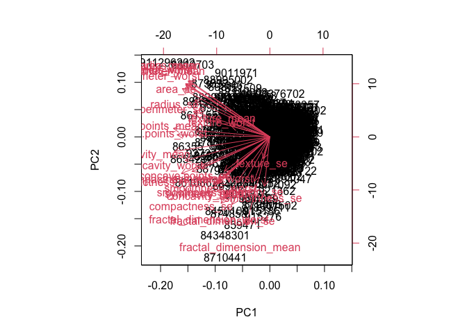
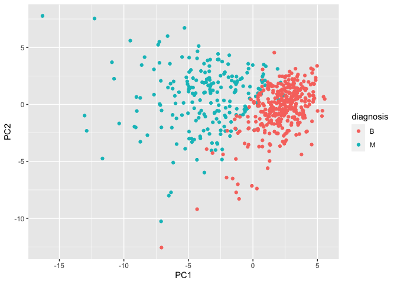
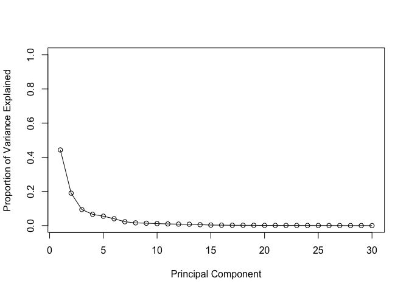
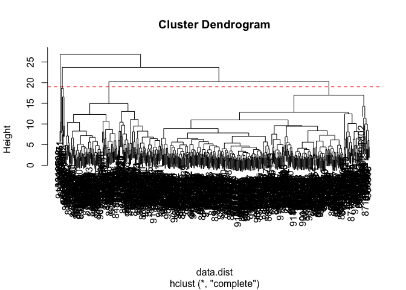
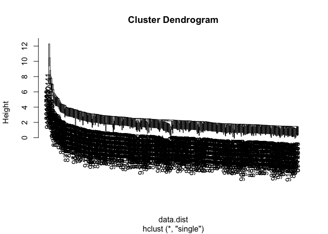
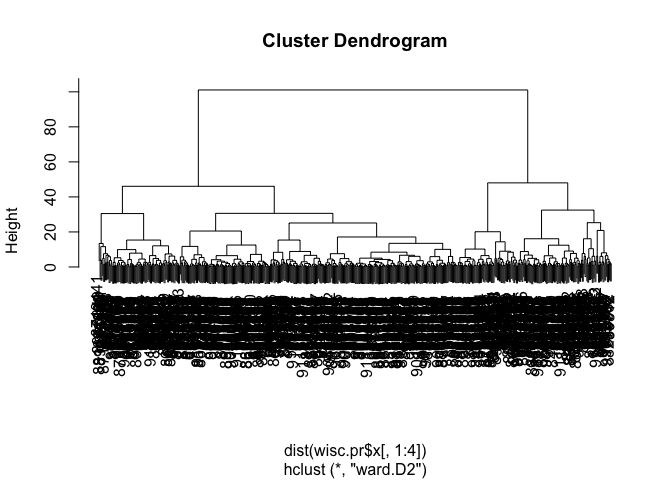

Class09_mini_project
================
Gabrielle Meza (A13747395)
10/27/2021

## R Markdown

Inputing data, and setting up names. we dont want diagnosis becuase that
is what we are trying to find, so we ar egetting rid of it in our
dataset and then storing it as another piece for later refernece

``` r
fna.data <- "WisconsinCancer.csv"
wisc.df <- read.csv(fna.data, row.names = 1)
head(wisc.df)
```

    ##          diagnosis radius_mean texture_mean perimeter_mean area_mean
    ## 842302           M       17.99        10.38         122.80    1001.0
    ## 842517           M       20.57        17.77         132.90    1326.0
    ## 84300903         M       19.69        21.25         130.00    1203.0
    ## 84348301         M       11.42        20.38          77.58     386.1
    ## 84358402         M       20.29        14.34         135.10    1297.0
    ## 843786           M       12.45        15.70          82.57     477.1
    ##          smoothness_mean compactness_mean concavity_mean concave.points_mean
    ## 842302           0.11840          0.27760         0.3001             0.14710
    ## 842517           0.08474          0.07864         0.0869             0.07017
    ## 84300903         0.10960          0.15990         0.1974             0.12790
    ## 84348301         0.14250          0.28390         0.2414             0.10520
    ## 84358402         0.10030          0.13280         0.1980             0.10430
    ## 843786           0.12780          0.17000         0.1578             0.08089
    ##          symmetry_mean fractal_dimension_mean radius_se texture_se perimeter_se
    ## 842302          0.2419                0.07871    1.0950     0.9053        8.589
    ## 842517          0.1812                0.05667    0.5435     0.7339        3.398
    ## 84300903        0.2069                0.05999    0.7456     0.7869        4.585
    ## 84348301        0.2597                0.09744    0.4956     1.1560        3.445
    ## 84358402        0.1809                0.05883    0.7572     0.7813        5.438
    ## 843786          0.2087                0.07613    0.3345     0.8902        2.217
    ##          area_se smoothness_se compactness_se concavity_se concave.points_se
    ## 842302    153.40      0.006399        0.04904      0.05373           0.01587
    ## 842517     74.08      0.005225        0.01308      0.01860           0.01340
    ## 84300903   94.03      0.006150        0.04006      0.03832           0.02058
    ## 84348301   27.23      0.009110        0.07458      0.05661           0.01867
    ## 84358402   94.44      0.011490        0.02461      0.05688           0.01885
    ## 843786     27.19      0.007510        0.03345      0.03672           0.01137
    ##          symmetry_se fractal_dimension_se radius_worst texture_worst
    ## 842302       0.03003             0.006193        25.38         17.33
    ## 842517       0.01389             0.003532        24.99         23.41
    ## 84300903     0.02250             0.004571        23.57         25.53
    ## 84348301     0.05963             0.009208        14.91         26.50
    ## 84358402     0.01756             0.005115        22.54         16.67
    ## 843786       0.02165             0.005082        15.47         23.75
    ##          perimeter_worst area_worst smoothness_worst compactness_worst
    ## 842302            184.60     2019.0           0.1622            0.6656
    ## 842517            158.80     1956.0           0.1238            0.1866
    ## 84300903          152.50     1709.0           0.1444            0.4245
    ## 84348301           98.87      567.7           0.2098            0.8663
    ## 84358402          152.20     1575.0           0.1374            0.2050
    ## 843786            103.40      741.6           0.1791            0.5249
    ##          concavity_worst concave.points_worst symmetry_worst
    ## 842302            0.7119               0.2654         0.4601
    ## 842517            0.2416               0.1860         0.2750
    ## 84300903          0.4504               0.2430         0.3613
    ## 84348301          0.6869               0.2575         0.6638
    ## 84358402          0.4000               0.1625         0.2364
    ## 843786            0.5355               0.1741         0.3985
    ##          fractal_dimension_worst
    ## 842302                   0.11890
    ## 842517                   0.08902
    ## 84300903                 0.08758
    ## 84348301                 0.17300
    ## 84358402                 0.07678
    ## 843786                   0.12440

``` r
wisc.data <- wisc.df[,-1]
diagnosis<- as.factor(wisc.df$diagnosis)
diagnosis
```

    ##   [1] M M M M M M M M M M M M M M M M M M M B B B M M M M M M M M M M M M M M M
    ##  [38] B M M M M M M M M B M B B B B B M M B M M B B B B M B M M B B B B M B M M
    ##  [75] B M B M M B B B M M B M M M B B B M B B M M B B B M M B B B B M B B M B B
    ## [112] B B B B B B M M M B M M B B B M M B M B M M B M M B B M B B M B B B B M B
    ## [149] B B B B B B B B M B B B B M M B M B B M M B B M M B B B B M B B M M M B M
    ## [186] B M B B B M B B M M B M M M M B M M M B M B M B B M B M M M M B B M M B B
    ## [223] B M B B B B B M M B B M B B M M B M B B B B M B B B B B M B M M M M M M M
    ## [260] M M M M M M M B B B B B B M B M B B M B B M B M M B B B B B B B B B B B B
    ## [297] B M B B M B M B B B B B B B B B B B B B B M B B B M B M B B B B M M M B B
    ## [334] B B M B M B M B B B M B B B B B B B M M M B B B B B B B B B B B M M B M M
    ## [371] M B M M B B B B B M B B B B B M B B B M B B M M B B B B B B M B B B B B B
    ## [408] B M B B B B B M B B M B B B B B B B B B B B B M B M M B M B B B B B M B B
    ## [445] M B M B B M B M B B B B B B B B M M B B B B B B M B B B B B B B B B B M B
    ## [482] B B B B B B M B M B B M B B B B B M M B M B M B B B B B M B B M B M B M M
    ## [519] B B B M B B B B B B B B B B B M B M M B B B B B B B B B B B B B B B B B B
    ## [556] B B B B B B B M M M M M M B
    ## Levels: B M

``` r
is.vector(diagnosis)
```

    ## [1] FALSE

> Q1. How many observations are in this dataset?

``` r
nrow(wisc.data)
```

    ## [1] 569

``` r
dim(wisc.data)
```

    ## [1] 569  30

> Q2. How many of the observations have a malignant diagnosis?

= assigns a value, == pulls to find. also table(diagnosis)works

``` r
sum(diagnosis=="M")
```

    ## [1] 212

``` r
sum(diagnosis=="B")
```

    ## [1] 357

``` r
table(diagnosis)
```

    ## diagnosis
    ##   B   M 
    ## 357 212

> Q3. How many variables/features in the data are suffixed with \_mean?

``` r
grep("_mean", colnames(wisc.data), value= TRUE )
```

    ##  [1] "radius_mean"            "texture_mean"           "perimeter_mean"        
    ##  [4] "area_mean"              "smoothness_mean"        "compactness_mean"      
    ##  [7] "concavity_mean"         "concave.points_mean"    "symmetry_mean"         
    ## [10] "fractal_dimension_mean"

``` r
meanvar <- grep("_mean", colnames(wisc.data), value= TRUE )
length(meanvar)
```

    ## [1] 10

#Check your data scaling is correct

``` r
colMeans(wisc.data)
```

    ##             radius_mean            texture_mean          perimeter_mean 
    ##            1.412729e+01            1.928965e+01            9.196903e+01 
    ##               area_mean         smoothness_mean        compactness_mean 
    ##            6.548891e+02            9.636028e-02            1.043410e-01 
    ##          concavity_mean     concave.points_mean           symmetry_mean 
    ##            8.879932e-02            4.891915e-02            1.811619e-01 
    ##  fractal_dimension_mean               radius_se              texture_se 
    ##            6.279761e-02            4.051721e-01            1.216853e+00 
    ##            perimeter_se                 area_se           smoothness_se 
    ##            2.866059e+00            4.033708e+01            7.040979e-03 
    ##          compactness_se            concavity_se       concave.points_se 
    ##            2.547814e-02            3.189372e-02            1.179614e-02 
    ##             symmetry_se    fractal_dimension_se            radius_worst 
    ##            2.054230e-02            3.794904e-03            1.626919e+01 
    ##           texture_worst         perimeter_worst              area_worst 
    ##            2.567722e+01            1.072612e+02            8.805831e+02 
    ##        smoothness_worst       compactness_worst         concavity_worst 
    ##            1.323686e-01            2.542650e-01            2.721885e-01 
    ##    concave.points_worst          symmetry_worst fractal_dimension_worst 
    ##            1.146062e-01            2.900756e-01            8.394582e-02

``` r
apply(wisc.data,2,sd)
```

    ##             radius_mean            texture_mean          perimeter_mean 
    ##            3.524049e+00            4.301036e+00            2.429898e+01 
    ##               area_mean         smoothness_mean        compactness_mean 
    ##            3.519141e+02            1.406413e-02            5.281276e-02 
    ##          concavity_mean     concave.points_mean           symmetry_mean 
    ##            7.971981e-02            3.880284e-02            2.741428e-02 
    ##  fractal_dimension_mean               radius_se              texture_se 
    ##            7.060363e-03            2.773127e-01            5.516484e-01 
    ##            perimeter_se                 area_se           smoothness_se 
    ##            2.021855e+00            4.549101e+01            3.002518e-03 
    ##          compactness_se            concavity_se       concave.points_se 
    ##            1.790818e-02            3.018606e-02            6.170285e-03 
    ##             symmetry_se    fractal_dimension_se            radius_worst 
    ##            8.266372e-03            2.646071e-03            4.833242e+00 
    ##           texture_worst         perimeter_worst              area_worst 
    ##            6.146258e+00            3.360254e+01            5.693570e+02 
    ##        smoothness_worst       compactness_worst         concavity_worst 
    ##            2.283243e-02            1.573365e-01            2.086243e-01 
    ##    concave.points_worst          symmetry_worst fractal_dimension_worst 
    ##            6.573234e-02            6.186747e-02            1.806127e-02

``` r
apply
```

    ## function (X, MARGIN, FUN, ..., simplify = TRUE) 
    ## {
    ##     FUN <- match.fun(FUN)
    ##     simplify <- isTRUE(simplify)
    ##     dl <- length(dim(X))
    ##     if (!dl) 
    ##         stop("dim(X) must have a positive length")
    ##     if (is.object(X)) 
    ##         X <- if (dl == 2L) 
    ##             as.matrix(X)
    ##         else as.array(X)
    ##     d <- dim(X)
    ##     dn <- dimnames(X)
    ##     ds <- seq_len(dl)
    ##     if (is.character(MARGIN)) {
    ##         if (is.null(dnn <- names(dn))) 
    ##             stop("'X' must have named dimnames")
    ##         MARGIN <- match(MARGIN, dnn)
    ##         if (anyNA(MARGIN)) 
    ##             stop("not all elements of 'MARGIN' are names of dimensions")
    ##     }
    ##     d.call <- d[-MARGIN]
    ##     d.ans <- d[MARGIN]
    ##     if (anyNA(d.call) || anyNA(d.ans)) 
    ##         stop("'MARGIN' does not match dim(X)")
    ##     s.call <- ds[-MARGIN]
    ##     s.ans <- ds[MARGIN]
    ##     dn.call <- dn[-MARGIN]
    ##     dn.ans <- dn[MARGIN]
    ##     d2 <- prod(d.ans)
    ##     if (d2 == 0L) {
    ##         newX <- array(vector(typeof(X), 1L), dim = c(prod(d.call), 
    ##             1L))
    ##         ans <- forceAndCall(1, FUN, if (length(d.call) < 2L) newX[, 
    ##             1] else array(newX[, 1L], d.call, dn.call), ...)
    ##         return(if (is.null(ans)) ans else if (length(d.ans) < 
    ##             2L) ans[1L][-1L] else array(ans, d.ans, dn.ans))
    ##     }
    ##     newX <- aperm(X, c(s.call, s.ans))
    ##     dim(newX) <- c(prod(d.call), d2)
    ##     ans <- vector("list", d2)
    ##     if (length(d.call) < 2L) {
    ##         if (length(dn.call)) 
    ##             dimnames(newX) <- c(dn.call, list(NULL))
    ##         for (i in 1L:d2) {
    ##             tmp <- forceAndCall(1, FUN, newX[, i], ...)
    ##             if (!is.null(tmp)) 
    ##                 ans[[i]] <- tmp
    ##         }
    ##     }
    ##     else for (i in 1L:d2) {
    ##         tmp <- forceAndCall(1, FUN, array(newX[, i], d.call, 
    ##             dn.call), ...)
    ##         if (!is.null(tmp)) 
    ##             ans[[i]] <- tmp
    ##     }
    ##     ans.list <- !simplify || is.recursive(ans[[1L]])
    ##     l.ans <- length(ans[[1L]])
    ##     ans.names <- names(ans[[1L]])
    ##     if (!ans.list) 
    ##         ans.list <- any(lengths(ans) != l.ans)
    ##     if (!ans.list && length(ans.names)) {
    ##         all.same <- vapply(ans, function(x) identical(names(x), 
    ##             ans.names), NA)
    ##         if (!all(all.same)) 
    ##             ans.names <- NULL
    ##     }
    ##     len.a <- if (ans.list) 
    ##         d2
    ##     else length(ans <- unlist(ans, recursive = FALSE))
    ##     if (length(MARGIN) == 1L && len.a == d2) {
    ##         names(ans) <- if (length(dn.ans[[1L]])) 
    ##             dn.ans[[1L]]
    ##         ans
    ##     }
    ##     else if (len.a == d2) 
    ##         array(ans, d.ans, dn.ans)
    ##     else if (len.a && len.a%%d2 == 0L) {
    ##         if (is.null(dn.ans)) 
    ##             dn.ans <- vector(mode = "list", length(d.ans))
    ##         dn1 <- list(ans.names)
    ##         if (length(dn.call) && !is.null(n1 <- names(dn <- dn.call[1])) && 
    ##             nzchar(n1) && length(ans.names) == length(dn[[1]])) 
    ##             names(dn1) <- n1
    ##         dn.ans <- c(dn1, dn.ans)
    ##         array(ans, c(len.a%/%d2, d.ans), if (!is.null(names(dn.ans)) || 
    ##             !all(vapply(dn.ans, is.null, NA))) 
    ##             dn.ans)
    ##     }
    ##     else ans
    ## }
    ## <bytecode: 0x7fb80b8e1980>
    ## <environment: namespace:base>

``` r
wisc.pr <- prcomp(wisc.data, scale=TRUE)
summary(wisc.pr)
```

    ## Importance of components:
    ##                           PC1    PC2     PC3     PC4     PC5     PC6     PC7
    ## Standard deviation     3.6444 2.3857 1.67867 1.40735 1.28403 1.09880 0.82172
    ## Proportion of Variance 0.4427 0.1897 0.09393 0.06602 0.05496 0.04025 0.02251
    ## Cumulative Proportion  0.4427 0.6324 0.72636 0.79239 0.84734 0.88759 0.91010
    ##                            PC8    PC9    PC10   PC11    PC12    PC13    PC14
    ## Standard deviation     0.69037 0.6457 0.59219 0.5421 0.51104 0.49128 0.39624
    ## Proportion of Variance 0.01589 0.0139 0.01169 0.0098 0.00871 0.00805 0.00523
    ## Cumulative Proportion  0.92598 0.9399 0.95157 0.9614 0.97007 0.97812 0.98335
    ##                           PC15    PC16    PC17    PC18    PC19    PC20   PC21
    ## Standard deviation     0.30681 0.28260 0.24372 0.22939 0.22244 0.17652 0.1731
    ## Proportion of Variance 0.00314 0.00266 0.00198 0.00175 0.00165 0.00104 0.0010
    ## Cumulative Proportion  0.98649 0.98915 0.99113 0.99288 0.99453 0.99557 0.9966
    ##                           PC22    PC23   PC24    PC25    PC26    PC27    PC28
    ## Standard deviation     0.16565 0.15602 0.1344 0.12442 0.09043 0.08307 0.03987
    ## Proportion of Variance 0.00091 0.00081 0.0006 0.00052 0.00027 0.00023 0.00005
    ## Cumulative Proportion  0.99749 0.99830 0.9989 0.99942 0.99969 0.99992 0.99997
    ##                           PC29    PC30
    ## Standard deviation     0.02736 0.01153
    ## Proportion of Variance 0.00002 0.00000
    ## Cumulative Proportion  1.00000 1.00000

> Q4. From your results, what proportion of the original variance is
> captured by the first principal components (PC1)?

44.27%

> Q5. How many principal components (PCs) are required to describe at
> least 70% of the original variance in the data?

Up to PC3

> Q6. How many principal components (PCs) are required to describe at
> least 90% of the original variance in the data?

up to PC7

``` r
biplot(wisc.pr)
```

<!-- -->

> Q7. What stands out to you about this plot? Is it easy or difficult to
> understand? Why?

It is super jumbled. You can not really tel anything from this, it is so
clumped together.

``` r
plot(wisc.pr$x[,1:2], col=diagnosis)
```

<!-- -->

> Q8. Generate a similar plot for principal components 1 and 3. What do
> you notice about these plots?

In the first plot, they are more differentiated, and spread out. Because
principal component 2 explains more variance in the original data than
principal component 3, you can see that the first plot has a cleaner cut
separating the two subgroups

``` r
plot(wisc.pr$x[,1], wisc.pr$x[,3], col=diagnosis, xlab="PC1", ylab= "PC3")
```

<!-- -->

``` r
df <- as.data.frame(wisc.pr$x)
df$diagnosis <- diagnosis
library(ggplot2)
ggplot(df) + 
  aes(PC1, PC2, col= diagnosis) + 
  geom_point()
```

<!-- -->

``` r
pr.var <- wisc.pr$sdev^2
head(pr.var)
```

    ## [1] 13.281608  5.691355  2.817949  1.980640  1.648731  1.207357

``` r
pve <- pr.var/ sum(pr.var)
```

``` r
plot(pve, xlab = "Principal Component", 
     ylab = "Proportion of Variance Explained", 
     ylim = c(0, 1), type = "o")
```

<!-- -->

``` r
barplot(pve, ylab = "Precent of Variance Explained",
     names.arg=paste0("PC",1:length(pve)), las=2, axes = FALSE)
axis(2, at=pve, labels=round(pve,2)*100 )
```

<!-- -->

> Q9. For the first principal component, what is the component of the
> loading vector (i.e. wisc.pr$rotation\[,1\]) for the feature
> concave.points_mean?

-0.26085376. this is the amount of shift in the axis rotation

``` r
wisc.pr$rotation[,1]
```

    ##             radius_mean            texture_mean          perimeter_mean 
    ##             -0.21890244             -0.10372458             -0.22753729 
    ##               area_mean         smoothness_mean        compactness_mean 
    ##             -0.22099499             -0.14258969             -0.23928535 
    ##          concavity_mean     concave.points_mean           symmetry_mean 
    ##             -0.25840048             -0.26085376             -0.13816696 
    ##  fractal_dimension_mean               radius_se              texture_se 
    ##             -0.06436335             -0.20597878             -0.01742803 
    ##            perimeter_se                 area_se           smoothness_se 
    ##             -0.21132592             -0.20286964             -0.01453145 
    ##          compactness_se            concavity_se       concave.points_se 
    ##             -0.17039345             -0.15358979             -0.18341740 
    ##             symmetry_se    fractal_dimension_se            radius_worst 
    ##             -0.04249842             -0.10256832             -0.22799663 
    ##           texture_worst         perimeter_worst              area_worst 
    ##             -0.10446933             -0.23663968             -0.22487053 
    ##        smoothness_worst       compactness_worst         concavity_worst 
    ##             -0.12795256             -0.21009588             -0.22876753 
    ##    concave.points_worst          symmetry_worst fractal_dimension_worst 
    ##             -0.25088597             -0.12290456             -0.13178394

> Q10. What is the minimum number of principal components required to
> explain 80% of the variance of the data?

You need 4 PCs to describe 80% of the varience. but that is with
rounding up, so really 5

``` r
var <- summary(wisc.pr)
var 
```

    ## Importance of components:
    ##                           PC1    PC2     PC3     PC4     PC5     PC6     PC7
    ## Standard deviation     3.6444 2.3857 1.67867 1.40735 1.28403 1.09880 0.82172
    ## Proportion of Variance 0.4427 0.1897 0.09393 0.06602 0.05496 0.04025 0.02251
    ## Cumulative Proportion  0.4427 0.6324 0.72636 0.79239 0.84734 0.88759 0.91010
    ##                            PC8    PC9    PC10   PC11    PC12    PC13    PC14
    ## Standard deviation     0.69037 0.6457 0.59219 0.5421 0.51104 0.49128 0.39624
    ## Proportion of Variance 0.01589 0.0139 0.01169 0.0098 0.00871 0.00805 0.00523
    ## Cumulative Proportion  0.92598 0.9399 0.95157 0.9614 0.97007 0.97812 0.98335
    ##                           PC15    PC16    PC17    PC18    PC19    PC20   PC21
    ## Standard deviation     0.30681 0.28260 0.24372 0.22939 0.22244 0.17652 0.1731
    ## Proportion of Variance 0.00314 0.00266 0.00198 0.00175 0.00165 0.00104 0.0010
    ## Cumulative Proportion  0.98649 0.98915 0.99113 0.99288 0.99453 0.99557 0.9966
    ##                           PC22    PC23   PC24    PC25    PC26    PC27    PC28
    ## Standard deviation     0.16565 0.15602 0.1344 0.12442 0.09043 0.08307 0.03987
    ## Proportion of Variance 0.00091 0.00081 0.0006 0.00052 0.00027 0.00023 0.00005
    ## Cumulative Proportion  0.99749 0.99830 0.9989 0.99942 0.99969 0.99992 0.99997
    ##                           PC29    PC30
    ## Standard deviation     0.02736 0.01153
    ## Proportion of Variance 0.00002 0.00000
    ## Cumulative Proportion  1.00000 1.00000

``` r
sum(var$importance[3,] < 0.8)
```

    ## [1] 4

``` r
data.scaled <- scale(wisc.data)
data.dist <- dist(data.scaled)
wisc.hclust <- hclust(data.dist, "complete")
wisc.hclust.other <- hclust(data.dist, "ward.D2")
plot(wisc.hclust.other)
```

<!-- -->

> Q11. Using the plot() and abline() functions, what is the height at
> which the clustering model has 4 clusters?

at height 19

``` r
plot(wisc.hclust)
abline(h=19, col="red", lty=2)
```

<!-- -->

``` r
wisc.hclust.clusters <- cutree(wisc.hclust, k = 4)
table(wisc.hclust.clusters, diagnosis)
```

    ##                     diagnosis
    ## wisc.hclust.clusters   B   M
    ##                    1  12 165
    ##                    2   2   5
    ##                    3 343  40
    ##                    4   0   2

> Q12. Can you find a better cluster vs diagnoses match by cutting into
> a different number of clusters between 2 and 10?

4 and 5 seem to be good clusters becuase the seperate each diagnosis,
and there are not a large amount of clusters with very few diagnosis
clouding up the data.

``` r
wisc.hclust.clusters.test <- cutree(wisc.hclust, k = 5)
table(wisc.hclust.clusters.test, diagnosis)
```

    ##                          diagnosis
    ## wisc.hclust.clusters.test   B   M
    ##                         1  12 165
    ##                         2   0   5
    ##                         3 343  40
    ##                         4   2   0
    ##                         5   0   2

> Q13. Which method gives your favorite results for the same data.dist
> dataset? Explain your reasoning.

i liked ward.D2 the most because it has a major set of clusters early on
that define 2 groups, and then more branching occurs. this matches that
in the cluster test there are 2 major groups that define B and M

``` r
wisc.hclust.other <- hclust(data.dist, "single")
plot(wisc.hclust.other)
```

<!-- -->

``` r
wisc.hclust.other1 <- hclust(data.dist, "average")
plot(wisc.hclust.other1)
```

<!-- -->

``` r
wisc.hclust.other2 <- hclust(data.dist, "ward.D2")
plot(wisc.hclust.other2)
```

<!-- -->

##Combinding Methods- Cluster my PCA results

I will use 4 PCS (Covers 80%) and ‘hclust()’ and ‘dist()’ as an input.
Has to be a distance matrix input

``` r
wisc.pr.hclust <- hclust(dist(wisc.pr$x[,1:4]), method = "ward.D2")
plot(wisc.pr.hclust)
```

<!-- -->

This cluster is showing me more separation than the other one. This
branching pattern is more structured. 2 subgroups can still be seen

``` r
plot(wisc.pr.hclust)
abline(h=80, col= "orange")
```

<!-- -->

Let’s find our cluster membership vector by cutting this tree into k=2
groups. will will name this grps as just a group separation display of
data. Then use table to to see the groupings.

``` r
grps <- cutree(wisc.pr.hclust, k=2)
table(grps)
```

    ## grps
    ##   1   2 
    ## 171 398

Now lets compare the expert M and B vector

``` r
table(diagnosis)
```

    ## diagnosis
    ##   B   M 
    ## 357 212

We can do a cross-table by giving the ‘table()’ function two inputs.

We want to know how many Ms are in a group and how many Bs are in the
other group

``` r
table(grps, diagnosis)
```

    ##     diagnosis
    ## grps   B   M
    ##    1   6 165
    ##    2 351  47

True positives: 165, True Negatives: 351, False Positives: 6, False
negatives: 6 **Accuracy**, essentially how many did we get correct?

About 89% accuracy, pretty good.

``` r
(161+351) / nrow(wisc.data)
```

    ## [1] 0.8998243

> Q15. How well does the newly created model with four clusters separate
> out the two diagnoses?

It seems to be pretty good, 89% is good, but not great. Using both
methods did make this grouping better.

> Q16. How well do the k-means and hierarchical clustering models you
> created in previous sections (i.e. before PCA) do in terms of
> separating the diagnoses? Again, use the table() function to compare
> the output of each model (wisc.km$cluster and wisc.hclust.clusters)
> with the vector containing the actual diagnoses.

‘Did not do kmeans’

They do look similar, but post PCA had more clear separation.

``` r
table(wisc.hclust.clusters, diagnosis)
```

    ##                     diagnosis
    ## wisc.hclust.clusters   B   M
    ##                    1  12 165
    ##                    2   2   5
    ##                    3 343  40
    ##                    4   0   2

``` r
table(grps, diagnosis)
```

    ##     diagnosis
    ## grps   B   M
    ##    1   6 165
    ##    2 351  47

> Q17. Which of your analysis procedures resulted in a clustering model
> with the best specificity? How about sensitivity?

This seems to be a more specfic analysis. I would prefer the more
sensitive analysis, better safe then sorry.

Sensitivity: test ability to correctly detect ill patients with the
condition. (TP/(TP+FN))

Specificity: test ability to correctly reject healthy patients without a
condition. (TN/(TN+FN))

``` r
(165/(165+47))
```

    ## [1] 0.7783019

``` r
(351/(351+47))
```

    ## [1] 0.8819095

## Prediction

We will use the predict() function that will take our PCA model from
before and new cancer cell data and project that data onto our PCA
space. npc is what we are creating

``` r
url <- "https://tinyurl.com/new-samples-CSV"
new <- read.csv(url)
npc <- predict(wisc.pr, newdata=new)
npc
```

    ##            PC1       PC2        PC3        PC4       PC5        PC6        PC7
    ## [1,]  2.576616 -3.135913  1.3990492 -0.7631950  2.781648 -0.8150185 -0.3959098
    ## [2,] -4.754928 -3.009033 -0.1660946 -0.6052952 -1.140698 -1.2189945  0.8193031
    ##             PC8       PC9       PC10      PC11      PC12      PC13     PC14
    ## [1,] -0.2307350 0.1029569 -0.9272861 0.3411457  0.375921 0.1610764 1.187882
    ## [2,] -0.3307423 0.5281896 -0.4855301 0.7173233 -1.185917 0.5893856 0.303029
    ##           PC15       PC16        PC17        PC18        PC19       PC20
    ## [1,] 0.3216974 -0.1743616 -0.07875393 -0.11207028 -0.08802955 -0.2495216
    ## [2,] 0.1299153  0.1448061 -0.40509706  0.06565549  0.25591230 -0.4289500
    ##            PC21       PC22       PC23       PC24        PC25         PC26
    ## [1,]  0.1228233 0.09358453 0.08347651  0.1223396  0.02124121  0.078884581
    ## [2,] -0.1224776 0.01732146 0.06316631 -0.2338618 -0.20755948 -0.009833238
    ##              PC27        PC28         PC29         PC30
    ## [1,]  0.220199544 -0.02946023 -0.015620933  0.005269029
    ## [2,] -0.001134152  0.09638361  0.002795349 -0.019015820

Now we will add these samples to our PCA plot.

pch is the shape cex is the size

``` r
plot(wisc.pr$x[,1:2], col=diagnosis)
points(npc[,1], npc[,2], col="blue", pch=16, cex=3)
text(npc[,1], npc[,2], c(1,2), col="white")
```

<!-- -->

> Q18. Which of these new patients should we prioritize for follow up
> based on your results?

Patient 2.
