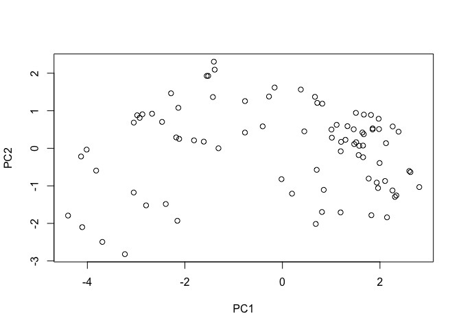
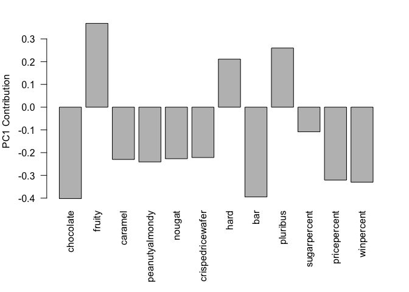

Class10:Candy
================
Gabrielle Meza (A13747395)
10/29/2021

``` r
read.csv("candy-data.txt")
```

    ##                 competitorname chocolate fruity caramel peanutyalmondy nougat
    ## 1                    100 Grand         1      0       1              0      0
    ## 2                 3 Musketeers         1      0       0              0      1
    ## 3                     One dime         0      0       0              0      0
    ## 4                  One quarter         0      0       0              0      0
    ## 5                    Air Heads         0      1       0              0      0
    ## 6                   Almond Joy         1      0       0              1      0
    ## 7                    Baby Ruth         1      0       1              1      1
    ## 8           Boston Baked Beans         0      0       0              1      0
    ## 9                   Candy Corn         0      0       0              0      0
    ## 10          Caramel Apple Pops         0      1       1              0      0
    ## 11             Charleston Chew         1      0       0              0      1
    ## 12  Chewey Lemonhead Fruit Mix         0      1       0              0      0
    ## 13                    Chiclets         0      1       0              0      0
    ## 14                        Dots         0      1       0              0      0
    ## 15                    Dum Dums         0      1       0              0      0
    ## 16                 Fruit Chews         0      1       0              0      0
    ## 17                     Fun Dip         0      1       0              0      0
    ## 18                  Gobstopper         0      1       0              0      0
    ## 19           Haribo Gold Bears         0      1       0              0      0
    ## 20           Haribo Happy Cola         0      0       0              0      0
    ## 21           Haribo Sour Bears         0      1       0              0      0
    ## 22          Haribo Twin Snakes         0      1       0              0      0
    ## 23            HersheyÕs Kisses         1      0       0              0      0
    ## 24           HersheyÕs Krackel         1      0       0              0      0
    ## 25    HersheyÕs Milk Chocolate         1      0       0              0      0
    ## 26      HersheyÕs Special Dark         1      0       0              0      0
    ## 27                  Jawbusters         0      1       0              0      0
    ## 28                Junior Mints         1      0       0              0      0
    ## 29                     Kit Kat         1      0       0              0      0
    ## 30                 Laffy Taffy         0      1       0              0      0
    ## 31                   Lemonhead         0      1       0              0      0
    ## 32 Lifesavers big ring gummies         0      1       0              0      0
    ## 33         Peanut butter M&MÕs         1      0       0              1      0
    ## 34                       M&MÕs         1      0       0              0      0
    ## 35                  Mike & Ike         0      1       0              0      0
    ## 36                   Milk Duds         1      0       1              0      0
    ## 37                   Milky Way         1      0       1              0      1
    ## 38          Milky Way Midnight         1      0       1              0      1
    ## 39    Milky Way Simply Caramel         1      0       1              0      0
    ## 40                      Mounds         1      0       0              0      0
    ## 41                 Mr Good Bar         1      0       0              1      0
    ## 42                       Nerds         0      1       0              0      0
    ## 43         Nestle Butterfinger         1      0       0              1      0
    ## 44               Nestle Crunch         1      0       0              0      0
    ## 45                   Nik L Nip         0      1       0              0      0
    ## 46                 Now & Later         0      1       0              0      0
    ## 47                      Payday         0      0       0              1      1
    ## 48                 Peanut M&Ms         1      0       0              1      0
    ## 49                Pixie Sticks         0      0       0              0      0
    ## 50                   Pop Rocks         0      1       0              0      0
    ## 51                   Red vines         0      1       0              0      0
    ## 52          ReeseÕs Miniatures         1      0       0              1      0
    ## 53   ReeseÕs Peanut Butter cup         1      0       0              1      0
    ## 54              ReeseÕs pieces         1      0       0              1      0
    ## 55 ReeseÕs stuffed with pieces         1      0       0              1      0
    ## 56                    Ring pop         0      1       0              0      0
    ## 57                        Rolo         1      0       1              0      0
    ## 58           Root Beer Barrels         0      0       0              0      0
    ## 59                       Runts         0      1       0              0      0
    ## 60                     Sixlets         1      0       0              0      0
    ## 61           Skittles original         0      1       0              0      0
    ## 62          Skittles wildberry         0      1       0              0      0
    ## 63             Nestle Smarties         1      0       0              0      0
    ## 64              Smarties candy         0      1       0              0      0
    ## 65                    Snickers         1      0       1              1      1
    ## 66            Snickers Crisper         1      0       1              1      0
    ## 67             Sour Patch Kids         0      1       0              0      0
    ## 68       Sour Patch Tricksters         0      1       0              0      0
    ## 69                   Starburst         0      1       0              0      0
    ## 70         Strawberry bon bons         0      1       0              0      0
    ## 71                Sugar Babies         0      0       1              0      0
    ## 72                 Sugar Daddy         0      0       1              0      0
    ## 73                Super Bubble         0      1       0              0      0
    ## 74                Swedish Fish         0      1       0              0      0
    ## 75                 Tootsie Pop         1      1       0              0      0
    ## 76        Tootsie Roll Juniors         1      0       0              0      0
    ## 77        Tootsie Roll Midgies         1      0       0              0      0
    ## 78     Tootsie Roll Snack Bars         1      0       0              0      0
    ## 79           Trolli Sour Bites         0      1       0              0      0
    ## 80                        Twix         1      0       1              0      0
    ## 81                   Twizzlers         0      1       0              0      0
    ## 82                    Warheads         0      1       0              0      0
    ## 83        WelchÕs Fruit Snacks         0      1       0              0      0
    ## 84  WertherÕs Original Caramel         0      0       1              0      0
    ## 85                    Whoppers         1      0       0              0      0
    ##    crispedricewafer hard bar pluribus sugarpercent pricepercent winpercent
    ## 1                 1    0   1        0        0.732        0.860   66.97173
    ## 2                 0    0   1        0        0.604        0.511   67.60294
    ## 3                 0    0   0        0        0.011        0.116   32.26109
    ## 4                 0    0   0        0        0.011        0.511   46.11650
    ## 5                 0    0   0        0        0.906        0.511   52.34146
    ## 6                 0    0   1        0        0.465        0.767   50.34755
    ## 7                 0    0   1        0        0.604        0.767   56.91455
    ## 8                 0    0   0        1        0.313        0.511   23.41782
    ## 9                 0    0   0        1        0.906        0.325   38.01096
    ## 10                0    0   0        0        0.604        0.325   34.51768
    ## 11                0    0   1        0        0.604        0.511   38.97504
    ## 12                0    0   0        1        0.732        0.511   36.01763
    ## 13                0    0   0        1        0.046        0.325   24.52499
    ## 14                0    0   0        1        0.732        0.511   42.27208
    ## 15                0    1   0        0        0.732        0.034   39.46056
    ## 16                0    0   0        1        0.127        0.034   43.08892
    ## 17                0    1   0        0        0.732        0.325   39.18550
    ## 18                0    1   0        1        0.906        0.453   46.78335
    ## 19                0    0   0        1        0.465        0.465   57.11974
    ## 20                0    0   0        1        0.465        0.465   34.15896
    ## 21                0    0   0        1        0.465        0.465   51.41243
    ## 22                0    0   0        1        0.465        0.465   42.17877
    ## 23                0    0   0        1        0.127        0.093   55.37545
    ## 24                1    0   1        0        0.430        0.918   62.28448
    ## 25                0    0   1        0        0.430        0.918   56.49050
    ## 26                0    0   1        0        0.430        0.918   59.23612
    ## 27                0    1   0        1        0.093        0.511   28.12744
    ## 28                0    0   0        1        0.197        0.511   57.21925
    ## 29                1    0   1        0        0.313        0.511   76.76860
    ## 30                0    0   0        0        0.220        0.116   41.38956
    ## 31                0    1   0        0        0.046        0.104   39.14106
    ## 32                0    0   0        0        0.267        0.279   52.91139
    ## 33                0    0   0        1        0.825        0.651   71.46505
    ## 34                0    0   0        1        0.825        0.651   66.57458
    ## 35                0    0   0        1        0.872        0.325   46.41172
    ## 36                0    0   0        1        0.302        0.511   55.06407
    ## 37                0    0   1        0        0.604        0.651   73.09956
    ## 38                0    0   1        0        0.732        0.441   60.80070
    ## 39                0    0   1        0        0.965        0.860   64.35334
    ## 40                0    0   1        0        0.313        0.860   47.82975
    ## 41                0    0   1        0        0.313        0.918   54.52645
    ## 42                0    1   0        1        0.848        0.325   55.35405
    ## 43                0    0   1        0        0.604        0.767   70.73564
    ## 44                1    0   1        0        0.313        0.767   66.47068
    ## 45                0    0   0        1        0.197        0.976   22.44534
    ## 46                0    0   0        1        0.220        0.325   39.44680
    ## 47                0    0   1        0        0.465        0.767   46.29660
    ## 48                0    0   0        1        0.593        0.651   69.48379
    ## 49                0    0   0        1        0.093        0.023   37.72234
    ## 50                0    1   0        1        0.604        0.837   41.26551
    ## 51                0    0   0        1        0.581        0.116   37.34852
    ## 52                0    0   0        0        0.034        0.279   81.86626
    ## 53                0    0   0        0        0.720        0.651   84.18029
    ## 54                0    0   0        1        0.406        0.651   73.43499
    ## 55                0    0   0        0        0.988        0.651   72.88790
    ## 56                0    1   0        0        0.732        0.965   35.29076
    ## 57                0    0   0        1        0.860        0.860   65.71629
    ## 58                0    1   0        1        0.732        0.069   29.70369
    ## 59                0    1   0        1        0.872        0.279   42.84914
    ## 60                0    0   0        1        0.220        0.081   34.72200
    ## 61                0    0   0        1        0.941        0.220   63.08514
    ## 62                0    0   0        1        0.941        0.220   55.10370
    ## 63                0    0   0        1        0.267        0.976   37.88719
    ## 64                0    1   0        1        0.267        0.116   45.99583
    ## 65                0    0   1        0        0.546        0.651   76.67378
    ## 66                1    0   1        0        0.604        0.651   59.52925
    ## 67                0    0   0        1        0.069        0.116   59.86400
    ## 68                0    0   0        1        0.069        0.116   52.82595
    ## 69                0    0   0        1        0.151        0.220   67.03763
    ## 70                0    1   0        1        0.569        0.058   34.57899
    ## 71                0    0   0        1        0.965        0.767   33.43755
    ## 72                0    0   0        0        0.418        0.325   32.23100
    ## 73                0    0   0        0        0.162        0.116   27.30386
    ## 74                0    0   0        1        0.604        0.755   54.86111
    ## 75                0    1   0        0        0.604        0.325   48.98265
    ## 76                0    0   0        0        0.313        0.511   43.06890
    ## 77                0    0   0        1        0.174        0.011   45.73675
    ## 78                0    0   1        0        0.465        0.325   49.65350
    ## 79                0    0   0        1        0.313        0.255   47.17323
    ## 80                1    0   1        0        0.546        0.906   81.64291
    ## 81                0    0   0        0        0.220        0.116   45.46628
    ## 82                0    1   0        0        0.093        0.116   39.01190
    ## 83                0    0   0        1        0.313        0.313   44.37552
    ## 84                0    1   0        0        0.186        0.267   41.90431
    ## 85                1    0   0        1        0.872        0.848   49.52411

``` r
candy_file <- "candy-data.txt"
candy = read.csv(candy_file, row.names=1)
head(candy)
```

    ##              chocolate fruity caramel peanutyalmondy nougat crispedricewafer
    ## 100 Grand            1      0       1              0      0                1
    ## 3 Musketeers         1      0       0              0      1                0
    ## One dime             0      0       0              0      0                0
    ## One quarter          0      0       0              0      0                0
    ## Air Heads            0      1       0              0      0                0
    ## Almond Joy           1      0       0              1      0                0
    ##              hard bar pluribus sugarpercent pricepercent winpercent
    ## 100 Grand       0   1        0        0.732        0.860   66.97173
    ## 3 Musketeers    0   1        0        0.604        0.511   67.60294
    ## One dime        0   0        0        0.011        0.116   32.26109
    ## One quarter     0   0        0        0.011        0.511   46.11650
    ## Air Heads       0   0        0        0.906        0.511   52.34146
    ## Almond Joy      0   1        0        0.465        0.767   50.34755

> Q1. How many different candy types are in this dataset?

``` r
nrow(candy)
```

    ## [1] 85

> Q2. How many fruity candy types are in the dataset?

``` r
sum(candy$fruity)
```

    ## [1] 38

> Q3. What is your favorite candy in the dataset and what is it’s
> winpercent value?

Twizzlers, 45.5%

``` r
candy["Twix", ]$winpercent
```

    ## [1] 81.64291

``` r
candy["Twizzlers", ]$winpercent
```

    ## [1] 45.46628

> Q4. What is the winpercent value for “Kit Kat”?

76.8%

``` r
candy["Kit Kat", ]$winpercent
```

    ## [1] 76.7686

> Q5. What is the winpercent value for “Tootsie Roll Snack Bars”?

49.6%

``` r
candy["Tootsie Roll Snack Bars", ]$winpercent
```

    ## [1] 49.6535

``` r
library("skimr")
skim(candy)
```

|                                                  |       |
|:-------------------------------------------------|:------|
| Name                                             | candy |
| Number of rows                                   | 85    |
| Number of columns                                | 12    |
| \_\_\_\_\_\_\_\_\_\_\_\_\_\_\_\_\_\_\_\_\_\_\_   |       |
| Column type frequency:                           |       |
| numeric                                          | 12    |
| \_\_\_\_\_\_\_\_\_\_\_\_\_\_\_\_\_\_\_\_\_\_\_\_ |       |
| Group variables                                  | None  |

Data summary

**Variable type: numeric**

| skim_variable    | n_missing | complete_rate |  mean |    sd |    p0 |   p25 |   p50 |   p75 |  p100 | hist  |
|:-----------------|----------:|--------------:|------:|------:|------:|------:|------:|------:|------:|:------|
| chocolate        |         0 |             1 |  0.44 |  0.50 |  0.00 |  0.00 |  0.00 |  1.00 |  1.00 | ▇▁▁▁▆ |
| fruity           |         0 |             1 |  0.45 |  0.50 |  0.00 |  0.00 |  0.00 |  1.00 |  1.00 | ▇▁▁▁▆ |
| caramel          |         0 |             1 |  0.16 |  0.37 |  0.00 |  0.00 |  0.00 |  0.00 |  1.00 | ▇▁▁▁▂ |
| peanutyalmondy   |         0 |             1 |  0.16 |  0.37 |  0.00 |  0.00 |  0.00 |  0.00 |  1.00 | ▇▁▁▁▂ |
| nougat           |         0 |             1 |  0.08 |  0.28 |  0.00 |  0.00 |  0.00 |  0.00 |  1.00 | ▇▁▁▁▁ |
| crispedricewafer |         0 |             1 |  0.08 |  0.28 |  0.00 |  0.00 |  0.00 |  0.00 |  1.00 | ▇▁▁▁▁ |
| hard             |         0 |             1 |  0.18 |  0.38 |  0.00 |  0.00 |  0.00 |  0.00 |  1.00 | ▇▁▁▁▂ |
| bar              |         0 |             1 |  0.25 |  0.43 |  0.00 |  0.00 |  0.00 |  0.00 |  1.00 | ▇▁▁▁▂ |
| pluribus         |         0 |             1 |  0.52 |  0.50 |  0.00 |  0.00 |  1.00 |  1.00 |  1.00 | ▇▁▁▁▇ |
| sugarpercent     |         0 |             1 |  0.48 |  0.28 |  0.01 |  0.22 |  0.47 |  0.73 |  0.99 | ▇▇▇▇▆ |
| pricepercent     |         0 |             1 |  0.47 |  0.29 |  0.01 |  0.26 |  0.47 |  0.65 |  0.98 | ▇▇▇▇▆ |
| winpercent       |         0 |             1 | 50.32 | 14.71 | 22.45 | 39.14 | 47.83 | 59.86 | 84.18 | ▃▇▆▅▂ |

> Q6. Is there any variable/column that looks to be on a different scale
> to the majority of the other columns in the dataset?

The 12 column, the win percentage. That seesm to be on a way higher
scale then the other.

> Q7. What do you think a zero and one represent for the candy$chocolate
> column?

The 1 indicates that that candy contains chocolate of some sorts, and 0
indicates is not a chocolate containing candy.

You can change the 1 and 0 to True and FALSE by using **as.logical**

``` r
as.logical(candy$chocolate)
```

    ##  [1]  TRUE  TRUE FALSE FALSE FALSE  TRUE  TRUE FALSE FALSE FALSE  TRUE FALSE
    ## [13] FALSE FALSE FALSE FALSE FALSE FALSE FALSE FALSE FALSE FALSE  TRUE  TRUE
    ## [25]  TRUE  TRUE FALSE  TRUE  TRUE FALSE FALSE FALSE  TRUE  TRUE FALSE  TRUE
    ## [37]  TRUE  TRUE  TRUE  TRUE  TRUE FALSE  TRUE  TRUE FALSE FALSE FALSE  TRUE
    ## [49] FALSE FALSE FALSE  TRUE  TRUE  TRUE  TRUE FALSE  TRUE FALSE FALSE  TRUE
    ## [61] FALSE FALSE  TRUE FALSE  TRUE  TRUE FALSE FALSE FALSE FALSE FALSE FALSE
    ## [73] FALSE FALSE  TRUE  TRUE  TRUE  TRUE FALSE  TRUE FALSE FALSE FALSE FALSE
    ## [85]  TRUE

> Q8. Plot a histogram of winpercent values

``` r
hist(candy$winpercent)
```

<!-- -->

> Q9. Is the distribution of winpercent values symmetrical?

No, it is not symetrical, but close. it is more dense on the left side.

> Q10. Is the center of the distribution above or below 50%?

Below 50%

``` r
median(candy$winpercent)
```

    ## [1] 47.82975

> Q11. On average is chocolate candy higher or lower ranked than fruit
> candy?

Average of all the chocolates: 60.92% Average of all the fruity: 44%

On average, chocolate is ranked higher

``` r
candy[as.logical(candy$chocolate),]
```

    ##                             chocolate fruity caramel peanutyalmondy nougat
    ## 100 Grand                           1      0       1              0      0
    ## 3 Musketeers                        1      0       0              0      1
    ## Almond Joy                          1      0       0              1      0
    ## Baby Ruth                           1      0       1              1      1
    ## Charleston Chew                     1      0       0              0      1
    ## HersheyÕs Kisses                    1      0       0              0      0
    ## HersheyÕs Krackel                   1      0       0              0      0
    ## HersheyÕs Milk Chocolate            1      0       0              0      0
    ## HersheyÕs Special Dark              1      0       0              0      0
    ## Junior Mints                        1      0       0              0      0
    ## Kit Kat                             1      0       0              0      0
    ## Peanut butter M&MÕs                 1      0       0              1      0
    ## M&MÕs                               1      0       0              0      0
    ## Milk Duds                           1      0       1              0      0
    ## Milky Way                           1      0       1              0      1
    ## Milky Way Midnight                  1      0       1              0      1
    ## Milky Way Simply Caramel            1      0       1              0      0
    ## Mounds                              1      0       0              0      0
    ## Mr Good Bar                         1      0       0              1      0
    ## Nestle Butterfinger                 1      0       0              1      0
    ## Nestle Crunch                       1      0       0              0      0
    ## Peanut M&Ms                         1      0       0              1      0
    ## ReeseÕs Miniatures                  1      0       0              1      0
    ## ReeseÕs Peanut Butter cup           1      0       0              1      0
    ## ReeseÕs pieces                      1      0       0              1      0
    ## ReeseÕs stuffed with pieces         1      0       0              1      0
    ## Rolo                                1      0       1              0      0
    ## Sixlets                             1      0       0              0      0
    ## Nestle Smarties                     1      0       0              0      0
    ## Snickers                            1      0       1              1      1
    ## Snickers Crisper                    1      0       1              1      0
    ## Tootsie Pop                         1      1       0              0      0
    ## Tootsie Roll Juniors                1      0       0              0      0
    ## Tootsie Roll Midgies                1      0       0              0      0
    ## Tootsie Roll Snack Bars             1      0       0              0      0
    ## Twix                                1      0       1              0      0
    ## Whoppers                            1      0       0              0      0
    ##                             crispedricewafer hard bar pluribus sugarpercent
    ## 100 Grand                                  1    0   1        0        0.732
    ## 3 Musketeers                               0    0   1        0        0.604
    ## Almond Joy                                 0    0   1        0        0.465
    ## Baby Ruth                                  0    0   1        0        0.604
    ## Charleston Chew                            0    0   1        0        0.604
    ## HersheyÕs Kisses                           0    0   0        1        0.127
    ## HersheyÕs Krackel                          1    0   1        0        0.430
    ## HersheyÕs Milk Chocolate                   0    0   1        0        0.430
    ## HersheyÕs Special Dark                     0    0   1        0        0.430
    ## Junior Mints                               0    0   0        1        0.197
    ## Kit Kat                                    1    0   1        0        0.313
    ## Peanut butter M&MÕs                        0    0   0        1        0.825
    ## M&MÕs                                      0    0   0        1        0.825
    ## Milk Duds                                  0    0   0        1        0.302
    ## Milky Way                                  0    0   1        0        0.604
    ## Milky Way Midnight                         0    0   1        0        0.732
    ## Milky Way Simply Caramel                   0    0   1        0        0.965
    ## Mounds                                     0    0   1        0        0.313
    ## Mr Good Bar                                0    0   1        0        0.313
    ## Nestle Butterfinger                        0    0   1        0        0.604
    ## Nestle Crunch                              1    0   1        0        0.313
    ## Peanut M&Ms                                0    0   0        1        0.593
    ## ReeseÕs Miniatures                         0    0   0        0        0.034
    ## ReeseÕs Peanut Butter cup                  0    0   0        0        0.720
    ## ReeseÕs pieces                             0    0   0        1        0.406
    ## ReeseÕs stuffed with pieces                0    0   0        0        0.988
    ## Rolo                                       0    0   0        1        0.860
    ## Sixlets                                    0    0   0        1        0.220
    ## Nestle Smarties                            0    0   0        1        0.267
    ## Snickers                                   0    0   1        0        0.546
    ## Snickers Crisper                           1    0   1        0        0.604
    ## Tootsie Pop                                0    1   0        0        0.604
    ## Tootsie Roll Juniors                       0    0   0        0        0.313
    ## Tootsie Roll Midgies                       0    0   0        1        0.174
    ## Tootsie Roll Snack Bars                    0    0   1        0        0.465
    ## Twix                                       1    0   1        0        0.546
    ## Whoppers                                   1    0   0        1        0.872
    ##                             pricepercent winpercent
    ## 100 Grand                          0.860   66.97173
    ## 3 Musketeers                       0.511   67.60294
    ## Almond Joy                         0.767   50.34755
    ## Baby Ruth                          0.767   56.91455
    ## Charleston Chew                    0.511   38.97504
    ## HersheyÕs Kisses                   0.093   55.37545
    ## HersheyÕs Krackel                  0.918   62.28448
    ## HersheyÕs Milk Chocolate           0.918   56.49050
    ## HersheyÕs Special Dark             0.918   59.23612
    ## Junior Mints                       0.511   57.21925
    ## Kit Kat                            0.511   76.76860
    ## Peanut butter M&MÕs                0.651   71.46505
    ## M&MÕs                              0.651   66.57458
    ## Milk Duds                          0.511   55.06407
    ## Milky Way                          0.651   73.09956
    ## Milky Way Midnight                 0.441   60.80070
    ## Milky Way Simply Caramel           0.860   64.35334
    ## Mounds                             0.860   47.82975
    ## Mr Good Bar                        0.918   54.52645
    ## Nestle Butterfinger                0.767   70.73564
    ## Nestle Crunch                      0.767   66.47068
    ## Peanut M&Ms                        0.651   69.48379
    ## ReeseÕs Miniatures                 0.279   81.86626
    ## ReeseÕs Peanut Butter cup          0.651   84.18029
    ## ReeseÕs pieces                     0.651   73.43499
    ## ReeseÕs stuffed with pieces        0.651   72.88790
    ## Rolo                               0.860   65.71629
    ## Sixlets                            0.081   34.72200
    ## Nestle Smarties                    0.976   37.88719
    ## Snickers                           0.651   76.67378
    ## Snickers Crisper                   0.651   59.52925
    ## Tootsie Pop                        0.325   48.98265
    ## Tootsie Roll Juniors               0.511   43.06890
    ## Tootsie Roll Midgies               0.011   45.73675
    ## Tootsie Roll Snack Bars            0.325   49.65350
    ## Twix                               0.906   81.64291
    ## Whoppers                           0.848   49.52411

``` r
chocolate <- candy[as.logical(candy$chocolate),]$winpercent
mean(chocolate)
```

    ## [1] 60.92153

``` r
candy[as.logical(candy$fruity),]
```

    ##                             chocolate fruity caramel peanutyalmondy nougat
    ## Air Heads                           0      1       0              0      0
    ## Caramel Apple Pops                  0      1       1              0      0
    ## Chewey Lemonhead Fruit Mix          0      1       0              0      0
    ## Chiclets                            0      1       0              0      0
    ## Dots                                0      1       0              0      0
    ## Dum Dums                            0      1       0              0      0
    ## Fruit Chews                         0      1       0              0      0
    ## Fun Dip                             0      1       0              0      0
    ## Gobstopper                          0      1       0              0      0
    ## Haribo Gold Bears                   0      1       0              0      0
    ## Haribo Sour Bears                   0      1       0              0      0
    ## Haribo Twin Snakes                  0      1       0              0      0
    ## Jawbusters                          0      1       0              0      0
    ## Laffy Taffy                         0      1       0              0      0
    ## Lemonhead                           0      1       0              0      0
    ## Lifesavers big ring gummies         0      1       0              0      0
    ## Mike & Ike                          0      1       0              0      0
    ## Nerds                               0      1       0              0      0
    ## Nik L Nip                           0      1       0              0      0
    ## Now & Later                         0      1       0              0      0
    ## Pop Rocks                           0      1       0              0      0
    ## Red vines                           0      1       0              0      0
    ## Ring pop                            0      1       0              0      0
    ## Runts                               0      1       0              0      0
    ## Skittles original                   0      1       0              0      0
    ## Skittles wildberry                  0      1       0              0      0
    ## Smarties candy                      0      1       0              0      0
    ## Sour Patch Kids                     0      1       0              0      0
    ## Sour Patch Tricksters               0      1       0              0      0
    ## Starburst                           0      1       0              0      0
    ## Strawberry bon bons                 0      1       0              0      0
    ## Super Bubble                        0      1       0              0      0
    ## Swedish Fish                        0      1       0              0      0
    ## Tootsie Pop                         1      1       0              0      0
    ## Trolli Sour Bites                   0      1       0              0      0
    ## Twizzlers                           0      1       0              0      0
    ## Warheads                            0      1       0              0      0
    ## WelchÕs Fruit Snacks                0      1       0              0      0
    ##                             crispedricewafer hard bar pluribus sugarpercent
    ## Air Heads                                  0    0   0        0        0.906
    ## Caramel Apple Pops                         0    0   0        0        0.604
    ## Chewey Lemonhead Fruit Mix                 0    0   0        1        0.732
    ## Chiclets                                   0    0   0        1        0.046
    ## Dots                                       0    0   0        1        0.732
    ## Dum Dums                                   0    1   0        0        0.732
    ## Fruit Chews                                0    0   0        1        0.127
    ## Fun Dip                                    0    1   0        0        0.732
    ## Gobstopper                                 0    1   0        1        0.906
    ## Haribo Gold Bears                          0    0   0        1        0.465
    ## Haribo Sour Bears                          0    0   0        1        0.465
    ## Haribo Twin Snakes                         0    0   0        1        0.465
    ## Jawbusters                                 0    1   0        1        0.093
    ## Laffy Taffy                                0    0   0        0        0.220
    ## Lemonhead                                  0    1   0        0        0.046
    ## Lifesavers big ring gummies                0    0   0        0        0.267
    ## Mike & Ike                                 0    0   0        1        0.872
    ## Nerds                                      0    1   0        1        0.848
    ## Nik L Nip                                  0    0   0        1        0.197
    ## Now & Later                                0    0   0        1        0.220
    ## Pop Rocks                                  0    1   0        1        0.604
    ## Red vines                                  0    0   0        1        0.581
    ## Ring pop                                   0    1   0        0        0.732
    ## Runts                                      0    1   0        1        0.872
    ## Skittles original                          0    0   0        1        0.941
    ## Skittles wildberry                         0    0   0        1        0.941
    ## Smarties candy                             0    1   0        1        0.267
    ## Sour Patch Kids                            0    0   0        1        0.069
    ## Sour Patch Tricksters                      0    0   0        1        0.069
    ## Starburst                                  0    0   0        1        0.151
    ## Strawberry bon bons                        0    1   0        1        0.569
    ## Super Bubble                               0    0   0        0        0.162
    ## Swedish Fish                               0    0   0        1        0.604
    ## Tootsie Pop                                0    1   0        0        0.604
    ## Trolli Sour Bites                          0    0   0        1        0.313
    ## Twizzlers                                  0    0   0        0        0.220
    ## Warheads                                   0    1   0        0        0.093
    ## WelchÕs Fruit Snacks                       0    0   0        1        0.313
    ##                             pricepercent winpercent
    ## Air Heads                          0.511   52.34146
    ## Caramel Apple Pops                 0.325   34.51768
    ## Chewey Lemonhead Fruit Mix         0.511   36.01763
    ## Chiclets                           0.325   24.52499
    ## Dots                               0.511   42.27208
    ## Dum Dums                           0.034   39.46056
    ## Fruit Chews                        0.034   43.08892
    ## Fun Dip                            0.325   39.18550
    ## Gobstopper                         0.453   46.78335
    ## Haribo Gold Bears                  0.465   57.11974
    ## Haribo Sour Bears                  0.465   51.41243
    ## Haribo Twin Snakes                 0.465   42.17877
    ## Jawbusters                         0.511   28.12744
    ## Laffy Taffy                        0.116   41.38956
    ## Lemonhead                          0.104   39.14106
    ## Lifesavers big ring gummies        0.279   52.91139
    ## Mike & Ike                         0.325   46.41172
    ## Nerds                              0.325   55.35405
    ## Nik L Nip                          0.976   22.44534
    ## Now & Later                        0.325   39.44680
    ## Pop Rocks                          0.837   41.26551
    ## Red vines                          0.116   37.34852
    ## Ring pop                           0.965   35.29076
    ## Runts                              0.279   42.84914
    ## Skittles original                  0.220   63.08514
    ## Skittles wildberry                 0.220   55.10370
    ## Smarties candy                     0.116   45.99583
    ## Sour Patch Kids                    0.116   59.86400
    ## Sour Patch Tricksters              0.116   52.82595
    ## Starburst                          0.220   67.03763
    ## Strawberry bon bons                0.058   34.57899
    ## Super Bubble                       0.116   27.30386
    ## Swedish Fish                       0.755   54.86111
    ## Tootsie Pop                        0.325   48.98265
    ## Trolli Sour Bites                  0.255   47.17323
    ## Twizzlers                          0.116   45.46628
    ## Warheads                           0.116   39.01190
    ## WelchÕs Fruit Snacks               0.313   44.37552

``` r
fruity <- candy[as.logical(candy$fruity),]$winpercent
mean(fruity)
```

    ## [1] 44.11974

> Q12. Is this difference statistically significant?

Yes, this is significant, becuase we have a very low p-value. When the
p-value, is less than 0.5, it indicates significantly.

``` r
t.test(chocolate, fruity)
```

    ## 
    ##  Welch Two Sample t-test
    ## 
    ## data:  chocolate and fruity
    ## t = 6.2582, df = 68.882, p-value = 2.871e-08
    ## alternative hypothesis: true difference in means is not equal to 0
    ## 95 percent confidence interval:
    ##  11.44563 22.15795
    ## sample estimates:
    ## mean of x mean of y 
    ##  60.92153  44.11974

> Q13. What are the five least liked candy types in this set?

Nik L Nip, Boston Baked Beans, Chiclets, Super Bubble, Jawbusters

``` r
library("dplyr")
```

    ## 
    ## Attaching package: 'dplyr'

    ## The following objects are masked from 'package:stats':
    ## 
    ##     filter, lag

    ## The following objects are masked from 'package:base':
    ## 
    ##     intersect, setdiff, setequal, union

``` r
rownames(head(candy[order(candy$winpercent),], n=5))
```

    ## [1] "Nik L Nip"          "Boston Baked Beans" "Chiclets"          
    ## [4] "Super Bubble"       "Jawbusters"

``` r
candy %>%
  arrange(winpercent) %>% head(5)
```

    ##                    chocolate fruity caramel peanutyalmondy nougat
    ## Nik L Nip                  0      1       0              0      0
    ## Boston Baked Beans         0      0       0              1      0
    ## Chiclets                   0      1       0              0      0
    ## Super Bubble               0      1       0              0      0
    ## Jawbusters                 0      1       0              0      0
    ##                    crispedricewafer hard bar pluribus sugarpercent pricepercent
    ## Nik L Nip                         0    0   0        1        0.197        0.976
    ## Boston Baked Beans                0    0   0        1        0.313        0.511
    ## Chiclets                          0    0   0        1        0.046        0.325
    ## Super Bubble                      0    0   0        0        0.162        0.116
    ## Jawbusters                        0    1   0        1        0.093        0.511
    ##                    winpercent
    ## Nik L Nip            22.44534
    ## Boston Baked Beans   23.41782
    ## Chiclets             24.52499
    ## Super Bubble         27.30386
    ## Jawbusters           28.12744

> Q14. What are the top 5 all time favorite candy types out of this set?

Reeses penut butter cups, reeseos minatures, twix, kit kat, snickers

``` r
candy %>%
  arrange(desc(winpercent)) %>% head(5)
```

    ##                           chocolate fruity caramel peanutyalmondy nougat
    ## ReeseÕs Peanut Butter cup         1      0       0              1      0
    ## ReeseÕs Miniatures                1      0       0              1      0
    ## Twix                              1      0       1              0      0
    ## Kit Kat                           1      0       0              0      0
    ## Snickers                          1      0       1              1      1
    ##                           crispedricewafer hard bar pluribus sugarpercent
    ## ReeseÕs Peanut Butter cup                0    0   0        0        0.720
    ## ReeseÕs Miniatures                       0    0   0        0        0.034
    ## Twix                                     1    0   1        0        0.546
    ## Kit Kat                                  1    0   1        0        0.313
    ## Snickers                                 0    0   1        0        0.546
    ##                           pricepercent winpercent
    ## ReeseÕs Peanut Butter cup        0.651   84.18029
    ## ReeseÕs Miniatures               0.279   81.86626
    ## Twix                             0.906   81.64291
    ## Kit Kat                          0.511   76.76860
    ## Snickers                         0.651   76.67378

``` r
rownames(head(candy[order(candy$winpercent, decreasing = TRUE),], n=5))
```

    ## [1] "ReeseÕs Peanut Butter cup" "ReeseÕs Miniatures"       
    ## [3] "Twix"                      "Kit Kat"                  
    ## [5] "Snickers"

> Q15. Make a first barplot of candy ranking based on winpercent values.

``` r
library(ggplot2)

ggplot(candy) +
  aes(x = winpercent, y= rownames(candy)) +
         geom_col()
```

<!-- -->

> Q16. This is quite ugly, use the reorder() function to get the bars
> sorted by winpercent?

``` r
ggplot(candy) +
  aes(x = winpercent, y= reorder(rownames(candy),winpercent)) +
         geom_col()
```

<!-- -->

``` r
my_cols=rep("black", nrow(candy))
my_cols[as.logical(candy$chocolate)] = "chocolate"
my_cols[as.logical(candy$bar)] = "brown"
my_cols[as.logical(candy$fruity)] = "pink"

ggplot(candy) + 
  aes(winpercent, reorder(rownames(candy),winpercent)) +
  geom_col(fill=my_cols) 
```

<!-- -->

> Q17. What is the worst ranked chocolate candy?

Boston Bajed beans

> Q18. What is the best ranked fruity candy?

Starburst

# 4. Taking a look at pricepercent

``` r
library(ggrepel)
ggplot(candy) +
  aes(winpercent, pricepercent, label=rownames(candy)) +
  geom_point(col=my_cols) + 
  geom_text_repel(col=my_cols)
```

    ## Warning: ggrepel: 29 unlabeled data points (too many overlaps). Consider
    ## increasing max.overlaps

<!-- -->

This shows all of the names, but you can use the **geom_repel** function
to make it less busy

``` r
ggplot(candy) +
  aes(winpercent, pricepercent, label=rownames(candy)) +
  geom_point(col=my_cols) + 
  geom_text_repel(col=my_cols, size=3.3, max.overlaps = 5)
```

    ## Warning: ggrepel: 50 unlabeled data points (too many overlaps). Consider
    ## increasing max.overlaps

<!-- -->

> Q19. Which candy type is the highest ranked in terms of winpercent for
> the least money - i.e. offers the most bang for your buck? reeseos
> minatures

``` r
ord <- order(candy$winpercent, decreasing = T)
head( candy[ord,c(11,12)], n=5 )
```

    ##                           pricepercent winpercent
    ## ReeseÕs Peanut Butter cup        0.651   84.18029
    ## ReeseÕs Miniatures               0.279   81.86626
    ## Twix                             0.906   81.64291
    ## Kit Kat                          0.511   76.76860
    ## Snickers                         0.651   76.67378

> Q20. What are the top 5 most expensive candy types in the dataset and
> of these which is the least popular?

Nik L Nips were the most expensive and least popular candy. See code for
the rest of the 5

``` r
ord2 <- order(candy$pricepercent, decreasing = TRUE)
head( candy[ord2,c(11,12)], n=5 )
```

    ##                          pricepercent winpercent
    ## Nik L Nip                       0.976   22.44534
    ## Nestle Smarties                 0.976   37.88719
    ## Ring pop                        0.965   35.29076
    ## HersheyÕs Krackel               0.918   62.28448
    ## HersheyÕs Milk Chocolate        0.918   56.49050

You can see that the writing is weird, this is becuae that is an
apostrophe. The gsub replaces the first things with the second things

``` r
gsub("Õ", "'", rownames(candy))
```

    ##  [1] "100 Grand"                   "3 Musketeers"               
    ##  [3] "One dime"                    "One quarter"                
    ##  [5] "Air Heads"                   "Almond Joy"                 
    ##  [7] "Baby Ruth"                   "Boston Baked Beans"         
    ##  [9] "Candy Corn"                  "Caramel Apple Pops"         
    ## [11] "Charleston Chew"             "Chewey Lemonhead Fruit Mix" 
    ## [13] "Chiclets"                    "Dots"                       
    ## [15] "Dum Dums"                    "Fruit Chews"                
    ## [17] "Fun Dip"                     "Gobstopper"                 
    ## [19] "Haribo Gold Bears"           "Haribo Happy Cola"          
    ## [21] "Haribo Sour Bears"           "Haribo Twin Snakes"         
    ## [23] "Hershey's Kisses"            "Hershey's Krackel"          
    ## [25] "Hershey's Milk Chocolate"    "Hershey's Special Dark"     
    ## [27] "Jawbusters"                  "Junior Mints"               
    ## [29] "Kit Kat"                     "Laffy Taffy"                
    ## [31] "Lemonhead"                   "Lifesavers big ring gummies"
    ## [33] "Peanut butter M&M's"         "M&M's"                      
    ## [35] "Mike & Ike"                  "Milk Duds"                  
    ## [37] "Milky Way"                   "Milky Way Midnight"         
    ## [39] "Milky Way Simply Caramel"    "Mounds"                     
    ## [41] "Mr Good Bar"                 "Nerds"                      
    ## [43] "Nestle Butterfinger"         "Nestle Crunch"              
    ## [45] "Nik L Nip"                   "Now & Later"                
    ## [47] "Payday"                      "Peanut M&Ms"                
    ## [49] "Pixie Sticks"                "Pop Rocks"                  
    ## [51] "Red vines"                   "Reese's Miniatures"         
    ## [53] "Reese's Peanut Butter cup"   "Reese's pieces"             
    ## [55] "Reese's stuffed with pieces" "Ring pop"                   
    ## [57] "Rolo"                        "Root Beer Barrels"          
    ## [59] "Runts"                       "Sixlets"                    
    ## [61] "Skittles original"           "Skittles wildberry"         
    ## [63] "Nestle Smarties"             "Smarties candy"             
    ## [65] "Snickers"                    "Snickers Crisper"           
    ## [67] "Sour Patch Kids"             "Sour Patch Tricksters"      
    ## [69] "Starburst"                   "Strawberry bon bons"        
    ## [71] "Sugar Babies"                "Sugar Daddy"                
    ## [73] "Super Bubble"                "Swedish Fish"               
    ## [75] "Tootsie Pop"                 "Tootsie Roll Juniors"       
    ## [77] "Tootsie Roll Midgies"        "Tootsie Roll Snack Bars"    
    ## [79] "Trolli Sour Bites"           "Twix"                       
    ## [81] "Twizzlers"                   "Warheads"                   
    ## [83] "Welch's Fruit Snacks"        "Werther's Original Caramel" 
    ## [85] "Whoppers"

# Correlation structure

``` r
library(corrplot)
```

    ## corrplot 0.92 loaded

``` r
cij <- cor(candy)
corrplot(cij)
```

<!-- -->

> Q22. Examining this plot what two variables are anti-correlated
> (i.e. have minus values)?

Fruity and chocolate

> Q23. Similarly, what two variables are most positively correlated?

chocolate and winpercent, or chocolate and bar

# PCA ANALYSIS TIME

``` r
pca <- prcomp(candy, scale = TRUE)
summary(pca)
```

    ## Importance of components:
    ##                           PC1    PC2    PC3     PC4    PC5     PC6     PC7
    ## Standard deviation     2.0788 1.1378 1.1092 1.07533 0.9518 0.81923 0.81530
    ## Proportion of Variance 0.3601 0.1079 0.1025 0.09636 0.0755 0.05593 0.05539
    ## Cumulative Proportion  0.3601 0.4680 0.5705 0.66688 0.7424 0.79830 0.85369
    ##                            PC8     PC9    PC10    PC11    PC12
    ## Standard deviation     0.74530 0.67824 0.62349 0.43974 0.39760
    ## Proportion of Variance 0.04629 0.03833 0.03239 0.01611 0.01317
    ## Cumulative Proportion  0.89998 0.93832 0.97071 0.98683 1.00000

``` r
plot(pca$x[,1:2])
```

<!-- -->

``` r
plot(pca$x[,1:2], col=my_cols, pch=16)
```

<!-- -->

``` r
my_data <- cbind(candy, pca$x[,1:3])
p <- ggplot(my_data) + 
        aes(x=PC1, y=PC2, 
            size=winpercent/100,  
            text=rownames(my_data),
            label=rownames(my_data)) +
        geom_point(col=my_cols)

p
```

<!-- -->

``` r
p + geom_text_repel(size=3.3, col=my_cols, max.overlaps = 7)  + 
  theme(legend.position = "none") +
  labs(title="Halloween Candy PCA Space",
       subtitle="Colored by type: chocolate bar (dark brown), chocolate other (light brown), fruity (red), other (black)",
       caption="Data from 538")
```

    ## Warning: ggrepel: 39 unlabeled data points (too many overlaps). Consider
    ## increasing max.overlaps

<!-- -->

``` r
par(mar=c(8,4,2,2))
barplot(pca$rotation[,1], las=2, ylab="PC1 Contribution")
```

<!-- -->

> Q24. What original variables are picked up strongly by PC1 in the
> positive direction? Do these make sense to you?

This makes sense! Fruity, hard, and pluribus. Most fruity candys that
people like are all these things! Starbursts, skittles, nerds etc. as to
where ther eis more variation with the chocolate. Twizzlers are not
ranked high, and are a good example of fruity but soft.
