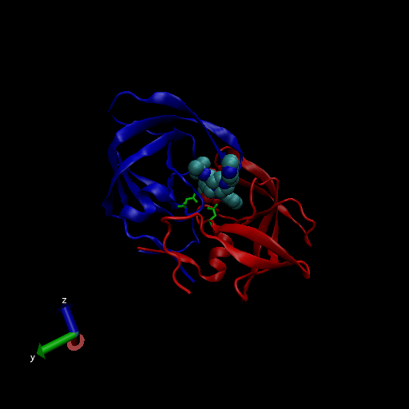

```{r setup, include=FALSE}
knitr::opts_chunk$set(echo = TRUE)
```

#1: Introduction to the RCSB Protein Data Bank (PDB)

```{r}
PBD_data <- read.csv(file = "Data Export Summary.csv", row.names = 1)
head(PBD_data)
```

> Q1: What percentage of structures in the PDB are solved by X-Ray and Electron Microscopy.

```{r}
sum(PBD_data$X.ray, PBD_data$EM)/sum(PBD_data$Total)*100
sum(PBD_data$X.ray)/sum(PBD_data$Total)*100
sum(PBD_data$EM)/sum(PBD_data$Total)*100
```

> Q2: What proportion of structures in the PDB are protein?

```{r}
#can use this PBD_data$Total[1] or what I used

(rowSums(PBD_data[1,1:6])/ sum(PBD_data$Total)) *100

```

> Q3: Type HIV in the PDB website search box on the home page and determine how many HIV-1 protease structures are in the current PDB?

23409 Structures

> Q4: Water molecules normally have 3 atoms. Why do we see just one atom per water molecule in this structure?

Because the hydrogen in water is so small and can not be resolved with the level of anstroms used for this protein. Therefore, Hydrogen is not used in these depictions

> Q5: There is a conserved water molecule in the binding site. Can you identify this water molecule? What residue number does this water molecule have (see note below)?

MERC protein binding site.  HOH 308



#3. Introduction to Bio3D in R

```{r}
library(bio3d)
pdb <- read.pdb("1hsg")
pdb
```

>Q7: How many amino acid residues are there in this pdb object? 

198

>Q8: Name one of the two non-protein residues? 

HOH- water, and MK1- Merc

>Q9: How many protein chains are in this structure? 

2

```{r}
attributes(pdb)
```

#Doing now for new protein- hel1

```{r}
pdb1 <- read.pdb("1hel")
pdb1
```

```{r}
#pdb$atom
```

Do a Normal Mode Analysis (NMA) a prediction of the confrontational variability an dintrinsic dynamics of this protein 

```{r}
m <- nma(pdb1)
plot(m)
```

You can make a little movie (trajectory) for viewing in VMD. 

```{r}
mktrj(m, file="nma.pdb")
```

