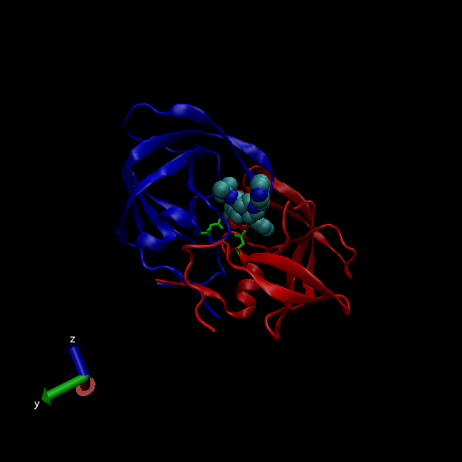
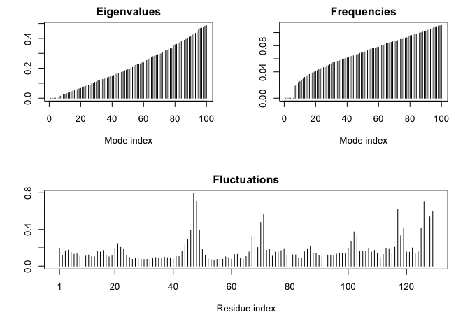

Class11
================

#1: Introduction to the RCSB Protein Data Bank (PDB)

``` r
PBD_data <- read.csv(file = "Data Export Summary.csv", row.names = 1)
head(PBD_data)
```

    ##                          X.ray   NMR   EM Multiple.methods Neutron Other  Total
    ## Protein (only)          142419 11807 6038              177      70    32 160543
    ## Protein/Oligosaccharide   8426    31  991                5       0     0   9453
    ## Protein/NA                7498   274 2000                3       0     0   9775
    ## Nucleic acid (only)       2368  1378   60                8       2     1   3817
    ## Other                      149    31    3                0       0     0    183
    ## Oligosaccharide (only)      11     6    0                1       0     4     22

> Q1: What percentage of structures in the PDB are solved by X-Ray and
> Electron Microscopy.

``` r
sum(PBD_data$X.ray, PBD_data$EM)/sum(PBD_data$Total)*100
```

    ## [1] 92.47523

``` r
sum(PBD_data$X.ray)/sum(PBD_data$Total)*100
```

    ## [1] 87.52836

``` r
sum(PBD_data$EM)/sum(PBD_data$Total)*100
```

    ## [1] 4.94687

> Q2: What proportion of structures in the PDB are protein?

``` r
#can use this PBD_data$Total[1] or what I used

(rowSums(PBD_data[1,1:6])/ sum(PBD_data$Total)) *100
```

    ## Protein (only) 
    ##        87.3499

> Q3: Type HIV in the PDB website search box on the home page and
> determine how many HIV-1 protease structures are in the current PDB?

23409 Structures

> Q4: Water molecules normally have 3 atoms. Why do we see just one atom
> per water molecule in this structure?

Because the hydrogen in water is so small and can not be resolved with
the level of anstroms used for this protein. Therefore, Hydrogen is not
used in these depictions

> Q5: There is a conserved water molecule in the binding site. Can you
> identify this water molecule? What residue number does this water
> molecule have (see note below)?

MERC protein binding site. HOH 308



#3. Introduction to Bio3D in R

``` r
library(bio3d)
pdb <- read.pdb("1hsg")
```

    ##   Note: Accessing on-line PDB file

``` r
pdb
```

    ## 
    ##  Call:  read.pdb(file = "1hsg")
    ## 
    ##    Total Models#: 1
    ##      Total Atoms#: 1686,  XYZs#: 5058  Chains#: 2  (values: A B)
    ## 
    ##      Protein Atoms#: 1514  (residues/Calpha atoms#: 198)
    ##      Nucleic acid Atoms#: 0  (residues/phosphate atoms#: 0)
    ## 
    ##      Non-protein/nucleic Atoms#: 172  (residues: 128)
    ##      Non-protein/nucleic resid values: [ HOH (127), MK1 (1) ]
    ## 
    ##    Protein sequence:
    ##       PQITLWQRPLVTIKIGGQLKEALLDTGADDTVLEEMSLPGRWKPKMIGGIGGFIKVRQYD
    ##       QILIEICGHKAIGTVLVGPTPVNIIGRNLLTQIGCTLNFPQITLWQRPLVTIKIGGQLKE
    ##       ALLDTGADDTVLEEMSLPGRWKPKMIGGIGGFIKVRQYDQILIEICGHKAIGTVLVGPTP
    ##       VNIIGRNLLTQIGCTLNF
    ## 
    ## + attr: atom, xyz, seqres, helix, sheet,
    ##         calpha, remark, call

> Q7: How many amino acid residues are there in this pdb object?

198

> Q8: Name one of the two non-protein residues?

HOH- water, and MK1- Merc

> Q9: How many protein chains are in this structure?

2

``` r
attributes(pdb)
```

    ## $names
    ## [1] "atom"   "xyz"    "seqres" "helix"  "sheet"  "calpha" "remark" "call"  
    ## 
    ## $class
    ## [1] "pdb" "sse"

#Doing now for new protein- hel1

``` r
pdb1 <- read.pdb("1hel")
```

    ##   Note: Accessing on-line PDB file

``` r
pdb1
```

    ## 
    ##  Call:  read.pdb(file = "1hel")
    ## 
    ##    Total Models#: 1
    ##      Total Atoms#: 1186,  XYZs#: 3558  Chains#: 1  (values: A)
    ## 
    ##      Protein Atoms#: 1001  (residues/Calpha atoms#: 129)
    ##      Nucleic acid Atoms#: 0  (residues/phosphate atoms#: 0)
    ## 
    ##      Non-protein/nucleic Atoms#: 185  (residues: 185)
    ##      Non-protein/nucleic resid values: [ HOH (185) ]
    ## 
    ##    Protein sequence:
    ##       KVFGRCELAAAMKRHGLDNYRGYSLGNWVCAAKFESNFNTQATNRNTDGSTDYGILQINS
    ##       RWWCNDGRTPGSRNLCNIPCSALLSSDITASVNCAKKIVSDGNGMNAWVAWRNRCKGTDV
    ##       QAWIRGCRL
    ## 
    ## + attr: atom, xyz, seqres, helix, sheet,
    ##         calpha, remark, call

``` r
#pdb$atom
```

Do a Normal Mode Analysis (NMA) a prediction of the confrontational
variability an dintrinsic dynamics of this protein

``` r
m <- nma(pdb1)
```

    ##  Building Hessian...     Done in 0.201 seconds.
    ##  Diagonalizing Hessian...    Done in 0.2 seconds.

``` r
plot(m)
```

<!-- -->

You can make a little movie (trajectory) for viewing in VMD.

``` r
mktrj(m, file="nma.pdb")
```
