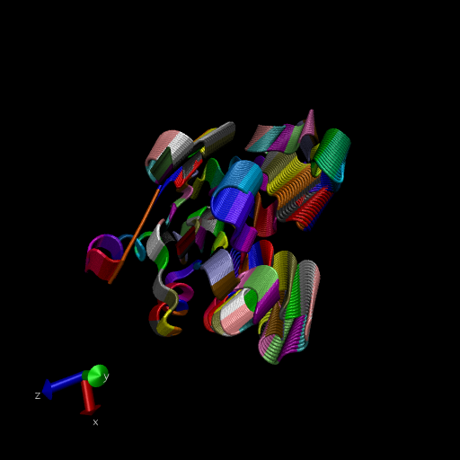

##Pipeline

Sequence in database -- `Blast.PDB()` --> Protein database -- `get.pdb()` --> Get structures of protein blast sequences -- `pdbaln()` --> get MSA (Multiple Sequence Alignments) -- `pca()` --> Principal component analysis data 

##4. Comparative structure analysis of Adenylate Kinase

```{r}
library(bio3d)
aa <- get.seq("1ake_A")
aa
```

> Q13. How many amino acids are in this sequence, i.e. how long is this sequence? 

214

```{r}
b <- blast.pdb(aa)
hits <- plot(b)

```

Now we have the top hits to our seq 

```{r}
head(hits$pdb.id)
```

To download related pdb files 

```{r}
files <- get.pdb(hits$pdb.id, path="pdbs", split=TRUE, gzip=TRUE)

```


##Align and superpose structures

Next we will use the **pdbaln()** function to align and also optionally fit (i.e. superpose) the identified PDB structures. This takes your "structures" step and moves you into MSA step (Multiple sequence alignment). Later, you can then take you MSA step and do PCA. 
```{r}
pdbs <- pdbaln(files, fit = TRUE)

```

Lets have a look at this, don't have in same code section or else it will re run it 

```{r}
pdbs
```


```{r}
# Vector containing PDB codes for figure axis
ids <- basename.pdb(pdbs$id)

# Draw schematic alignment
plot(pdbs, labels=ids)
```


##Now to link this MSA to PCA Analysis

Here we will do PCS on the xyz coordinate data of all these structures with the `pca()` function in bio3d

```{r}
pc <- pca(pdbs)
plot(pc)
```

Let's visualize the displacements (i.e. movements of the structure) that are captured by PC1

```{r}
mktrj(pc,pc=1, file="pca.pdb")
```

Now time to paste in the VMD image!! Here it is..



Let's savee our important results, once you open again, you can use **load("myresults.RData")**

```{r}
##save(b,hits,pc,pdbs, [file = "myresults.RData"])
```


