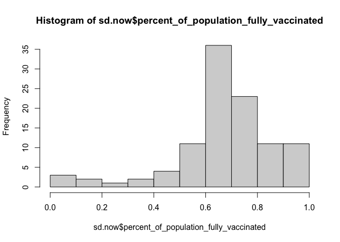
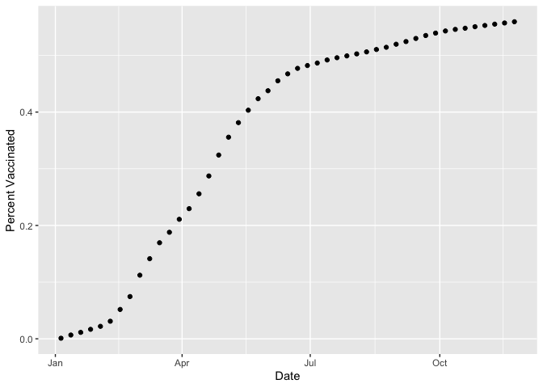
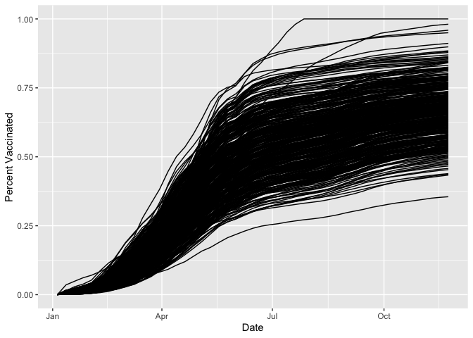
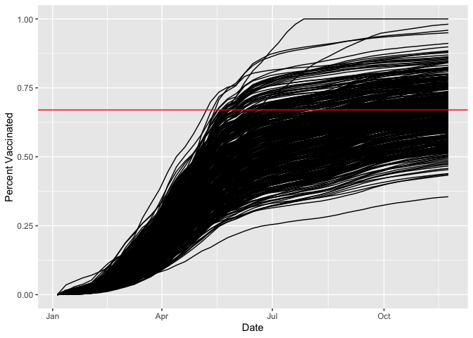

Class17
================
Gabrielle Meza (A13747395)
11/24/2021

``` r
vax <- read.csv("covid19vaccinesbyzipcode_test.csv")
head(vax)
```

    ##   as_of_date zip_code_tabulation_area local_health_jurisdiction         county
    ## 1 2021-01-05                    92395            San Bernardino San Bernardino
    ## 2 2021-01-05                    93206                      Kern           Kern
    ## 3 2021-01-05                    91006               Los Angeles    Los Angeles
    ## 4 2021-01-05                    91901                 San Diego      San Diego
    ## 5 2021-01-05                    92230                 Riverside      Riverside
    ## 6 2021-01-05                    92662                    Orange         Orange
    ##   vaccine_equity_metric_quartile                 vem_source
    ## 1                              1 Healthy Places Index Score
    ## 2                              1 Healthy Places Index Score
    ## 3                              3 Healthy Places Index Score
    ## 4                              3 Healthy Places Index Score
    ## 5                              1 Healthy Places Index Score
    ## 6                              4 Healthy Places Index Score
    ##   age12_plus_population age5_plus_population persons_fully_vaccinated
    ## 1               35915.3                40888                       NA
    ## 2                1237.5                 1521                       NA
    ## 3               28742.7                31347                       19
    ## 4               15549.8                16905                       12
    ## 5                2320.2                 2526                       NA
    ## 6                2349.5                 2397                       NA
    ##   persons_partially_vaccinated percent_of_population_fully_vaccinated
    ## 1                           NA                                     NA
    ## 2                           NA                                     NA
    ## 3                          873                               0.000606
    ## 4                          271                               0.000710
    ## 5                           NA                                     NA
    ## 6                           NA                                     NA
    ##   percent_of_population_partially_vaccinated
    ## 1                                         NA
    ## 2                                         NA
    ## 3                                   0.027850
    ## 4                                   0.016031
    ## 5                                         NA
    ## 6                                         NA
    ##   percent_of_population_with_1_plus_dose
    ## 1                                     NA
    ## 2                                     NA
    ## 3                               0.028456
    ## 4                               0.016741
    ## 5                                     NA
    ## 6                                     NA
    ##                                                                redacted
    ## 1 Information redacted in accordance with CA state privacy requirements
    ## 2 Information redacted in accordance with CA state privacy requirements
    ## 3                                                                    No
    ## 4                                                                    No
    ## 5 Information redacted in accordance with CA state privacy requirements
    ## 6 Information redacted in accordance with CA state privacy requirements

``` r
colnames(vax)
```

    ##  [1] "as_of_date"                                
    ##  [2] "zip_code_tabulation_area"                  
    ##  [3] "local_health_jurisdiction"                 
    ##  [4] "county"                                    
    ##  [5] "vaccine_equity_metric_quartile"            
    ##  [6] "vem_source"                                
    ##  [7] "age12_plus_population"                     
    ##  [8] "age5_plus_population"                      
    ##  [9] "persons_fully_vaccinated"                  
    ## [10] "persons_partially_vaccinated"              
    ## [11] "percent_of_population_fully_vaccinated"    
    ## [12] "percent_of_population_partially_vaccinated"
    ## [13] "percent_of_population_with_1_plus_dose"    
    ## [14] "redacted"

> Q1. What column details the total number of people fully vaccinated?

“persons_fully_vaccinated”

> Q2. What column details the Zip code tabulation area?

“zip_code_tabulation_area”

> Q3. What is the earliest date in this dataset?

``` r
min(vax$as_of_date)
```

    ## [1] "2021-01-05"

> Q4. What is the latest date in this dataset?

``` r
max(vax$as_of_date)
```

    ## [1] "2021-11-23"

let’s call the **skim()** function from the skimr package to get a quick
overview of this dataset:

``` r
skimr::skim(vax)
```

|                                                  |       |
|:-------------------------------------------------|:------|
| Name                                             | vax   |
| Number of rows                                   | 82908 |
| Number of columns                                | 14    |
| \_\_\_\_\_\_\_\_\_\_\_\_\_\_\_\_\_\_\_\_\_\_\_   |       |
| Column type frequency:                           |       |
| character                                        | 5     |
| numeric                                          | 9     |
| \_\_\_\_\_\_\_\_\_\_\_\_\_\_\_\_\_\_\_\_\_\_\_\_ |       |
| Group variables                                  | None  |

Data summary

**Variable type: character**

| skim_variable             | n_missing | complete_rate | min | max | empty | n_unique | whitespace |
|:--------------------------|----------:|--------------:|----:|----:|------:|---------:|-----------:|
| as_of_date                |         0 |             1 |  10 |  10 |     0 |       47 |          0 |
| local_health_jurisdiction |         0 |             1 |   0 |  15 |   235 |       62 |          0 |
| county                    |         0 |             1 |   0 |  15 |   235 |       59 |          0 |
| vem_source                |         0 |             1 |  15 |  26 |     0 |        3 |          0 |
| redacted                  |         0 |             1 |   2 |  69 |     0 |        2 |          0 |

**Variable type: numeric**

| skim_variable                              | n_missing | complete_rate |     mean |       sd |    p0 |      p25 |      p50 |      p75 |     p100 | hist  |
|:-------------------------------------------|----------:|--------------:|---------:|---------:|------:|---------:|---------:|---------:|---------:|:------|
| zip_code_tabulation_area                   |         0 |          1.00 | 93665.11 |  1817.39 | 90001 | 92257.75 | 93658.50 | 95380.50 |  97635.0 | ▃▅▅▇▁ |
| vaccine_equity_metric_quartile             |      4089 |          0.95 |     2.44 |     1.11 |     1 |     1.00 |     2.00 |     3.00 |      4.0 | ▇▇▁▇▇ |
| age12_plus_population                      |         0 |          1.00 | 18895.04 | 18993.94 |     0 |  1346.95 | 13685.10 | 31756.12 |  88556.7 | ▇▃▂▁▁ |
| age5_plus_population                       |         0 |          1.00 | 20875.24 | 21106.04 |     0 |  1460.50 | 15364.00 | 34877.00 | 101902.0 | ▇▃▂▁▁ |
| persons_fully_vaccinated                   |      8355 |          0.90 |  9585.35 | 11609.12 |    11 |   516.00 |  4210.00 | 16095.00 |  71219.0 | ▇▂▁▁▁ |
| persons_partially_vaccinated               |      8355 |          0.90 |  1894.87 |  2105.55 |    11 |   198.00 |  1269.00 |  2880.00 |  20159.0 | ▇▁▁▁▁ |
| percent_of_population_fully_vaccinated     |      8355 |          0.90 |     0.43 |     0.27 |     0 |     0.20 |     0.44 |     0.63 |      1.0 | ▇▆▇▆▂ |
| percent_of_population_partially_vaccinated |      8355 |          0.90 |     0.10 |     0.10 |     0 |     0.06 |     0.07 |     0.11 |      1.0 | ▇▁▁▁▁ |
| percent_of_population_with_1\_plus_dose    |      8355 |          0.90 |     0.51 |     0.26 |     0 |     0.31 |     0.53 |     0.71 |      1.0 | ▅▅▇▇▃ |

> Q5. How many numeric columns are in this dataset?

9

> Q6. Note that there are “missing values” in the dataset. How many NA
> values there in the persons_fully_vaccinated column?

``` r
sum( is.na(vax$persons_fully_vaccinated) )
```

    ## [1] 8355

> Q7. What percent of persons_fully_vaccinated values are missing (to 2
> significant figures)?

``` r
nrow(vax)
```

    ## [1] 82908

``` r
(8355/ 82908) * 100
```

    ## [1] 10.07744

One of the “character” columns of the data is as_of_date, which contains
dates in the Year-Month-Day format.

Dates and times can be annoying to work with at the best of times.
However, in R we have the excellent lubridate package, which can make
life allot easier. Here is a quick example to get you started:

``` r
library(lubridate)
```

    ## 
    ## Attaching package: 'lubridate'

    ## The following objects are masked from 'package:base':
    ## 
    ##     date, intersect, setdiff, union

``` r
today()
```

    ## [1] "2021-12-06"

> Q9. How many days have passed since the last update of the dataset?

``` r
# Specify that we are using the year-month-day format
vax$as_of_date <- ymd(vax$as_of_date)
```

> Q10. How many unique dates are in the dataset (i.e. how many different
> dates are detailed)?

``` r
today() - vax$as_of_date[1]
```

    ## Time difference of 335 days

In R we can use the **zipcodeR** package to make working with these
codes easier

``` r
library(zipcodeR)
geocode_zip('92037')
```

    ## # A tibble: 1 × 3
    ##   zipcode   lat   lng
    ##   <chr>   <dbl> <dbl>
    ## 1 92037    32.8 -117.

Calculate the distance between the centroids of any two ZIP codes in
miles, e.g.

``` r
zip_distance('92037','92109')
```

    ##   zipcode_a zipcode_b distance
    ## 1     92037     92109     2.33

More usefully, we can pull census data about ZIP code areas (including
median household income etc.

``` r
reverse_zipcode(c('92037', "92109") )
```

    ## # A tibble: 2 × 24
    ##   zipcode zipcode_type major_city post_office_city common_city_list county state
    ##   <chr>   <chr>        <chr>      <chr>                      <blob> <chr>  <chr>
    ## 1 92037   Standard     La Jolla   La Jolla, CA           <raw 20 B> San D… CA   
    ## 2 92109   Standard     San Diego  San Diego, CA          <raw 21 B> San D… CA   
    ## # … with 17 more variables: lat <dbl>, lng <dbl>, timezone <chr>,
    ## #   radius_in_miles <dbl>, area_code_list <blob>, population <int>,
    ## #   population_density <dbl>, land_area_in_sqmi <dbl>,
    ## #   water_area_in_sqmi <dbl>, housing_units <int>,
    ## #   occupied_housing_units <int>, median_home_value <int>,
    ## #   median_household_income <int>, bounds_west <dbl>, bounds_east <dbl>,
    ## #   bounds_north <dbl>, bounds_south <dbl>

> How many unique zip code

``` r
length(unique(vax$zip_code_tabulation_area))
```

    ## [1] 1764

Subsetting can get tedious and complicated quickly. we will use the
**filter()** function to do our subsetting from now on. this uses
**dlypr()**

We want to focus in on the San Diego County

``` r
library(dplyr)
```

    ## 
    ## Attaching package: 'dplyr'

    ## The following objects are masked from 'package:stats':
    ## 
    ##     filter, lag

    ## The following objects are masked from 'package:base':
    ## 
    ##     intersect, setdiff, setequal, union

``` r
sd <- filter(vax, county == "San Diego")
```

``` r
nrow(sd)
```

    ## [1] 5029

> Q11. How many distinct zip codes are listed for San Diego County?

``` r
length(unique(sd$zip_code_tabulation_area))
```

    ## [1] 107

> Q12. What San Diego County Zip code area has the largest 12 +
> Population in this dataset?

``` r
which.max(vax$age12_plus_population)
```

    ## [1] 192

``` r
vax$zip_code_tabulation_area[which.max(vax$age12_plus_population)]
```

    ## [1] 91331

``` r
sd$zip_code_tabulation_area[which.max(sd$age12_plus_population)]
```

    ## [1] 92154

More complicated subsetting

``` r
sd.20 <- filter(vax, county == "San Diego", 
       age5_plus_population > 20000)

nrow(sd.20)
```

    ## [1] 3055

> Q13. what is the average vaccination rate of San Diego as of
> yesterday?

``` r
sd.now <- filter(vax, county=="San Diego",
                 as_of_date=="2021-11-23")
head(sd.now)
```

    ##   as_of_date zip_code_tabulation_area local_health_jurisdiction    county
    ## 1 2021-11-23                    92120                 San Diego San Diego
    ## 2 2021-11-23                    91962                 San Diego San Diego
    ## 3 2021-11-23                    92155                 San Diego San Diego
    ## 4 2021-11-23                    92147                 San Diego San Diego
    ## 5 2021-11-23                    91913                 San Diego San Diego
    ## 6 2021-11-23                    92114                 San Diego San Diego
    ##   vaccine_equity_metric_quartile                 vem_source
    ## 1                              4 Healthy Places Index Score
    ## 2                              3 Healthy Places Index Score
    ## 3                             NA            No VEM Assigned
    ## 4                             NA            No VEM Assigned
    ## 5                              3 Healthy Places Index Score
    ## 6                              2 Healthy Places Index Score
    ##   age12_plus_population age5_plus_population persons_fully_vaccinated
    ## 1               26372.9                28414                    21234
    ## 2                1758.7                 2020                      948
    ## 3                 456.0                  456                       70
    ## 4                 518.0                  518                       NA
    ## 5               43514.7                50461                    37974
    ## 6               59050.7                64945                    43708
    ##   persons_partially_vaccinated percent_of_population_fully_vaccinated
    ## 1                         3198                               0.747308
    ## 2                          126                               0.469307
    ## 3                           20                               0.153509
    ## 4                           NA                                     NA
    ## 5                         6690                               0.752542
    ## 6                         6261                               0.673000
    ##   percent_of_population_partially_vaccinated
    ## 1                                   0.112550
    ## 2                                   0.062376
    ## 3                                   0.043860
    ## 4                                         NA
    ## 5                                   0.132578
    ## 6                                   0.096405
    ##   percent_of_population_with_1_plus_dose
    ## 1                               0.859858
    ## 2                               0.531683
    ## 3                               0.197369
    ## 4                                     NA
    ## 5                               0.885120
    ## 6                               0.769405
    ##                                                                redacted
    ## 1                                                                    No
    ## 2                                                                    No
    ## 3                                                                    No
    ## 4 Information redacted in accordance with CA state privacy requirements
    ## 5                                                                    No
    ## 6                                                                    No

``` r
sd.now$percent_of_population_fully_vaccinated
```

    ##   [1] 0.747308 0.469307 0.153509       NA 0.752542 0.673000 0.171930 0.628913
    ##   [9] 0.355234 0.686848 0.496899 0.694990 0.725720 0.576161 0.652680 0.806525
    ##  [17] 0.718495 1.000000 0.633126 0.835713 0.855294 0.657697 0.631422 0.846959
    ##  [25] 0.769692 1.000000       NA 0.628480 0.844500       NA 0.683163 0.523179
    ##  [33] 0.082372 0.771474 0.464088 0.592998 0.651956 0.632170 0.571643 0.656561
    ##  [41] 0.603904 0.626561 0.691278 0.723539 0.813734 0.707481 0.730845 0.617369
    ##  [49] 0.841184 0.743946 0.759115 1.000000 0.676833 0.944622 0.667700 0.638762
    ##  [57] 0.766287 1.000000 0.711136 0.743590 0.798508 0.916196 0.694622 0.613783
    ##  [65] 0.526130 0.641578 0.700739 0.484584 0.370307 0.594036 0.618409 0.682470
    ##  [73] 0.863395 0.840959 1.000000 0.249635 0.610675 1.000000 0.729044 0.614751
    ##  [81] 0.586075 0.699525 1.000000 0.769195 0.715999 0.670258 1.000000 0.521976
    ##  [89] 0.010726 0.732941 0.632636 0.559401 0.010169 0.639952 0.891644 0.713647
    ##  [97] 0.672947 0.653994 0.569850 0.665486 0.523125 0.673358 0.951807 0.604313
    ## [105] 0.744649 0.787222 0.894858

``` r
summary(sd.now$percent_of_population_fully_vaccinated)
```

    ##    Min. 1st Qu.  Median    Mean 3rd Qu.    Max.    NA's 
    ## 0.01017 0.61301 0.67965 0.67400 0.76932 1.00000       3

> Q14. Using either ggplot or base R graphics make a summary figure that
> shows the distribution of Percent of Population Fully Vaccinated
> values as of “2021-11-09”? As a histogram

``` r
hist(sd.now$percent_of_population_fully_vaccinated)
```

<!-- -->

This plot above is going to be susceptible to being skewed by ZIP code
areas with small populations. these will have big effects for just a
small number of unvax-ed folks…

Now focus on UCSD/La Jolla area

> Q. What is the population of the 92037 ZIP code area?

``` r
ucsd <- filter(sd.now, zip_code_tabulation_area=="92037")
ucsd$age5_plus_population
```

    ## [1] 36144

> Q. What is the average vaccination value for this UCSD/La Jolla ZIP
> code area?

``` r
ucsd$percent_of_population_fully_vaccinated
```

    ## [1] 0.916196

> Lets do my zipcode! 92124 and then where i am going: 92065

``` r
tierrasanta<- filter(sd.now, zip_code_tabulation_area=="92124")
tierrasanta$age5_plus_population
```

    ## [1] 29040

``` r
tierrasanta$percent_of_population_fully_vaccinated
```

    ## [1] 0.559401

``` r
ramona <- filter(sd.now, zip_code_tabulation_area=="92065")
ramona$percent_of_population_fully_vaccinated
```

    ## [1] 0.52613

Lets make a time series of vacination rate for a given ZIP code area. I
will do 92124

``` r
ttown <- filter(vax, zip_code_tabulation_area == "92124")
library(ggplot2)
```

``` r
ggplot(ttown) + 
  aes(x=as_of_date, y=percent_of_population_fully_vaccinated) + 
  geom_point() +
  labs(x="Date", y="Percent Vaccinated")
```

<!-- -->

Let’s make this plot for all of SD county zip codes that have a
population as large as 92037 (UCSD)

``` r
sd.36 <- filter(vax, county=="San Diego",
                age5_plus_population > 36144)
head(sd.36)
```

    ##   as_of_date zip_code_tabulation_area local_health_jurisdiction    county
    ## 1 2021-01-05                    92058                 San Diego San Diego
    ## 2 2021-01-05                    92078                 San Diego San Diego
    ## 3 2021-01-05                    92019                 San Diego San Diego
    ## 4 2021-01-05                    92117                 San Diego San Diego
    ## 5 2021-01-05                    92057                 San Diego San Diego
    ## 6 2021-01-05                    91913                 San Diego San Diego
    ##   vaccine_equity_metric_quartile                 vem_source
    ## 1                              1 Healthy Places Index Score
    ## 2                              3 Healthy Places Index Score
    ## 3                              3 Healthy Places Index Score
    ## 4                              3 Healthy Places Index Score
    ## 5                              2 Healthy Places Index Score
    ## 6                              3 Healthy Places Index Score
    ##   age12_plus_population age5_plus_population persons_fully_vaccinated
    ## 1               34956.0                39695                       NA
    ## 2               41789.5                47476                       37
    ## 3               37439.4                40464                       25
    ## 4               50041.6                53839                       42
    ## 5               51927.0                56906                       22
    ## 6               43514.7                50461                       37
    ##   persons_partially_vaccinated percent_of_population_fully_vaccinated
    ## 1                           NA                                     NA
    ## 2                          688                               0.000779
    ## 3                          610                               0.000618
    ## 4                         1143                               0.000780
    ## 5                          691                               0.000387
    ## 6                         1993                               0.000733
    ##   percent_of_population_partially_vaccinated
    ## 1                                         NA
    ## 2                                   0.014492
    ## 3                                   0.015075
    ## 4                                   0.021230
    ## 5                                   0.012143
    ## 6                                   0.039496
    ##   percent_of_population_with_1_plus_dose
    ## 1                                     NA
    ## 2                               0.015271
    ## 3                               0.015693
    ## 4                               0.022010
    ## 5                               0.012530
    ## 6                               0.040229
    ##                                                                redacted
    ## 1 Information redacted in accordance with CA state privacy requirements
    ## 2                                                                    No
    ## 3                                                                    No
    ## 4                                                                    No
    ## 5                                                                    No
    ## 6                                                                    No

> Lets do a plot for all of california, with similar populations.
> Populations bigger than UCSD: 36144

``` r
ca <- filter(vax, age5_plus_population > 36144)
```

How many zip codes withth is pop?

``` r
length(unique(ca$zip_code_tabulation_area))
```

    ## [1] 411

Now lets make the plot

``` r
ggplot(ca) + 
  aes(x=as_of_date, y=percent_of_population_fully_vaccinated, 
      group=zip_code_tabulation_area) +
  geom_line(alpjha=0.2) +
  labs(x="Date", y="Percent Vaccinated")
```

    ## Warning: Ignoring unknown parameters: alpjha

    ## Warning: Removed 176 row(s) containing missing values (geom_path).

<!-- -->

What is the mean across the state for these 36k+ population areas?

``` r
ca.now <- filter(ca, as_of_date=="2021-11-22")
summary(ca.now$percent_of_population_fully_vaccinated)
```

    ##    Min. 1st Qu.  Median    Mean 3rd Qu.    Max. 
    ## 

Add a line for the mean % of people vaccinated in California.

``` r
 ggplot(ca) + 
  aes(x=as_of_date, y=percent_of_population_fully_vaccinated, 
      group=zip_code_tabulation_area) +
  geom_line(alpjha=0.2) +
  labs(x="Date", y="Percent Vaccinated") +
  geom_hline(yintercept = 0.67, color = "Red")
```

    ## Warning: Ignoring unknown parameters: alpjha

    ## Warning: Removed 176 row(s) containing missing values (geom_path).

<!-- -->
