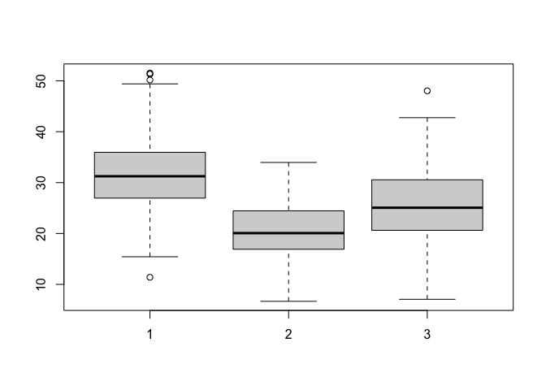
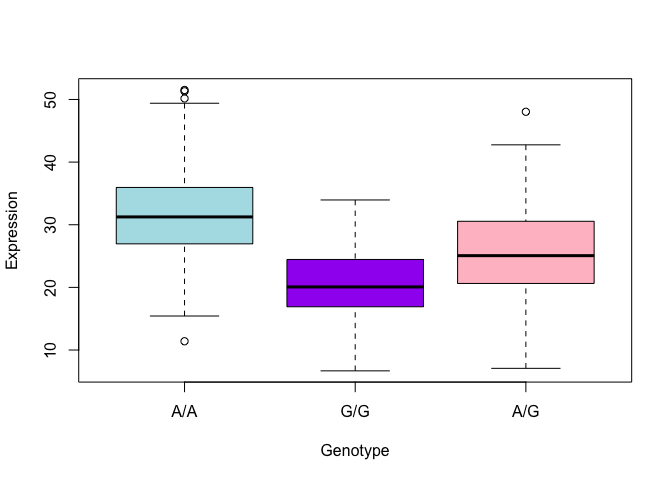

Class19_HW
================
Gabrielle Meza (A13747395)
12/1/2021

> Q13: Read this file into R and determine the sample size for each
> genotype and their corresponding median expression levels for each of
> these genotypes.

``` r
data <- read.table("Expression_Results.txt")
head(data)
```

    ##    sample geno      exp
    ## 1 HG00367  A/G 28.96038
    ## 2 NA20768  A/G 20.24449
    ## 3 HG00361  A/A 31.32628
    ## 4 HG00135  A/A 34.11169
    ## 5 NA18870  G/G 18.25141
    ## 6 NA11993  A/A 32.89721

``` r
sum(data$geno == "A/G")
```

    ## [1] 233

``` r
sum(data$geno == "G/G")
```

    ## [1] 121

``` r
sum(data$geno == "A/A")
```

    ## [1] 108

``` r
library(dplyr)
```

    ## 
    ## Attaching package: 'dplyr'

    ## The following objects are masked from 'package:stats':
    ## 
    ##     filter, lag

    ## The following objects are masked from 'package:base':
    ## 
    ##     intersect, setdiff, setequal, union

``` r
ag <- data %>% filter(geno == "A/G")
gg <- data %>% filter(geno == "G/G")
aa <- data %>% filter(geno == "A/A")
```

``` r
median(ag$exp)
```

    ## [1] 25.06486

``` r
median(gg$exp)
```

    ## [1] 20.07363

``` r
median(aa$exp)
```

    ## [1] 31.24847

A/G genotype: 233 A/G median expression: 25.06

G/G genotype: 121 G/G median expression: 20.07

A/A genotype: 108 A/A median expression: 31.24

> Q14: Generate a boxplot with a box per genotype, what could you infer
> from the relative expression value between A/A and G/G displayed in
> this plot? Does the SNP effect the expression of ORMDL3?

``` r
boxplot(aa$exp, gg$exp, ag$exp)
```

<!-- -->

``` r
boxplot(aa$exp, gg$exp, ag$exp, col= c("powderblue","purple","pink"), names = c("A/A", "G/G", "A/G"), xlab = "Genotype", ylab= "Expression")
```

<!-- -->

People with the A/A genotype have higher ORMDL3 expression than the G/G
genotype. This, along with the fact that A/G also is also has higher
expression, is good evidence that the SNP of an A instead of G does have
an impact on ORMDL3 expression, specifically an increase in expression.
So these A/A genotypes, in my opinion, are more likely to have asthma.
